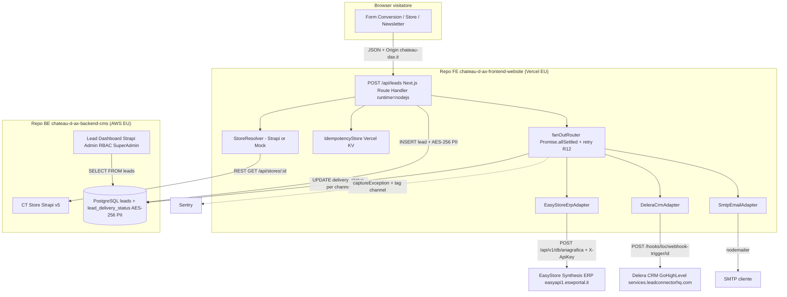
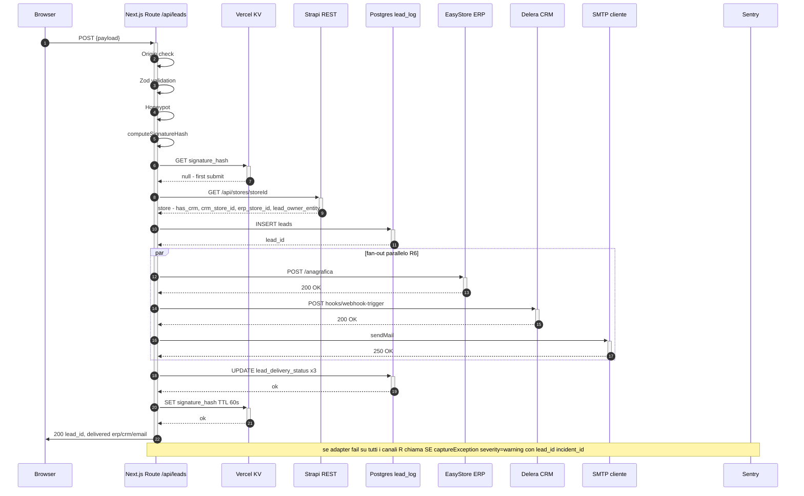
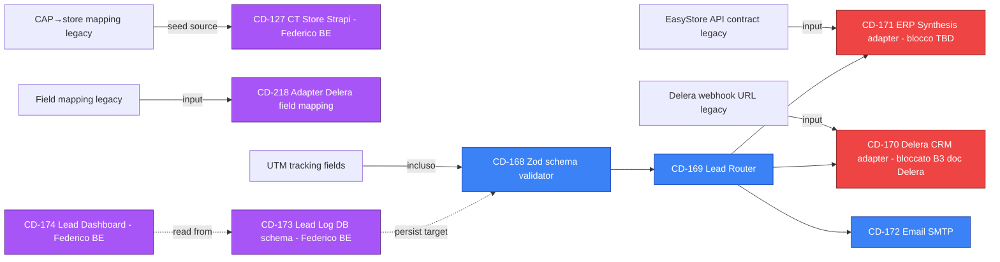
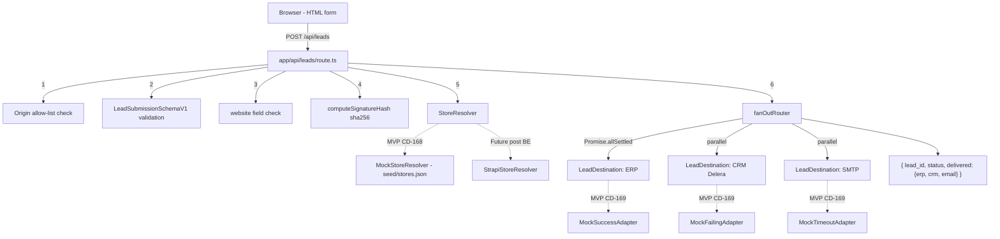

# Lead Hub Foundation — CD-168 + CD-169

> **Aggiornamento 20/05/2026 — sezione 0 aggiunta**: feasibility analysis dell'approccio Next.js API Routes basata su review del codice legacy AWS Lambda `smistatore Chateaux D'ax`. Conferma piena fattibilità + design ad alto livello FE ↔ BE Strapi ↔ sistemi esterni. Vedi [sezione 0 sotto](#0-feasibility-analysis--high-level-design).

---

## 0. Feasibility Analysis & High-Level Design

> Reference Jira: [CD-130 Lead Hub Epic](https://neversleep.atlassian.net/browse/CD-130) · Sotto-task: [CD-168](https://neversleep.atlassian.net/browse/CD-168) · [CD-169](https://neversleep.atlassian.net/browse/CD-169) · [CD-170](https://neversleep.atlassian.net/browse/CD-170) · [CD-171](https://neversleep.atlassian.net/browse/CD-171) · [CD-172](https://neversleep.atlassian.net/browse/CD-172) · [CD-173](https://neversleep.atlassian.net/browse/CD-173) · [CD-174](https://neversleep.atlassian.net/browse/CD-174)

### 0.1 — Cosa fa il legacy `smistatore Chateaux D'ax` (analisi review)

Il legacy è una **AWS Lambda Node.js 18** (`exports.handler = async (event) => {...}`) chiamata da un sistema upstream (form PHP della vecchia agenzia + landing). Esegue routing di un lead a 3 destinazioni:

| # | Destinazione | Endpoint | Pattern legacy | Status |
|---|---|---|---|---|
| 1 | **EasyStore ERP** | `https://easyapi1.eswportal.it/api/v1/{db_connection}/anagrafica` | POST + header `X-ApiKey` (env). Always-call se `hot_lead=true`. Payload: `codice_azienda`, `codice_stato`, `nome`, `cognome`, `mobile1`, `mail`, `codice_venditore: UTE1`, `provenienza`, `canale`, `sottocanale` (mese IT), `cap` | **DA MIGRARE → CD-171** (Synthesis di fatto, conferma R2) |
| 2 | **Delera CRM (GoHighLevel)** | `https://services.leadconnectorhq.com/hooks/{loc_id}/webhook-trigger/{webhook_id}` | POST. Solo per 10 codici Comaco (`153, 141, 152, 156, 142, 140, 155, 151, 147, 149`) + Genova (`1GE`). Payload arricchito con `sede`, UTM fields, `messaggio`, `page_title` | **DA MIGRARE → CD-170** |
| 3 | Google Sheets | Service Account JSON file in repo | 3 tab: anno corrente / LeadComaco / LeadBeinette. Audit "manuale" senza DB strutturato | **SCARTATO** (sostituito da Lead Log DB CD-173) |

**Routing logic legacy** (`helpers/CRM/capStoreMapping.js`, ~500 righe):
1. Input: `JSON_BODY.contact.cap` (CAP utente)
2. `findKeyByCAP(cap)` → cerca in `ZONA_MAPPING` (range tipo `25010-25089+25121-25136 → '141'`)
3. Default `'T00'` se non trovato
4. Lookup `DB_DETAILS_MAPPING[zona]` → `{ db_connection, db_name, zona (indirizzo) }`
5. Hardcoded if-else per Delera Comaco vs Delera Genova

**Auth/security legacy**:
- Doppia signature: `x-webhook-signature` (HMAC SHA256 con `SIGNIN_PRIVATE_KEY`) per source moderna + `php-forms-signature` (env var hardcoded) per source PHP legacy
- HMAC su `JSON.stringify(BODY)` — fragile (ordine chiavi JS non determinato dallo standard)
- `Access-Control-Allow-Origin: *` (only in error path — incoerente)
- Credenziali Google in `chateau-dax-438207-40358471bc96.json` checked-in (RED FLAG)

**Payload input legacy** (`JSON_BODY.contact`):
```json
{
  "firstName", "lastName", "phone", "email", "cap",
  "language", "countryCode", "numero_di_telefono",
  "CANALE", "hot_lead", "created_at",
  "utm_source", "utm_medium", "utm_campaign", "utm_term", "utm_content", "utm_id",
  "messaggio", "page_title"
}
```

**Anti-pattern individuati (review checklist 5 assi):**

| Asse | Issue | Severity | Mitigation nel nuovo design |
|---|---|---|---|
| **Correctness** | Doppio `JSON.parse(event.body)` (cleanedBody + BODY) — redundant + fragile | M | Zod parse one-shot |
| **Correctness** | HMAC su `JSON.stringify(BODY)` ordine chiavi non stabile | H | Origin allow-list + signature_hash deterministico (sha256 di campi ordinati) |
| **Correctness** | `hot_lead` client-spoofable gate-all (`if (JSON_BODY.contact.hot_lead)` skippa tutto se assente) | H | Rimuovere gate "hot lead"; ogni lead va processato |
| **Architecture** | Routing hardcoded if-else (10 codici Comaco + 1GE), non estensibile | H | LeadDestination interface + `isApplicable(store)` per ogni adapter (R2/R6) |
| **Architecture** | CAP→store logic in repo Lambda; non source-of-truth condiviso | H | Sposta in CT Store Strapi (`has_crm`, `crm_store_id`, `erp_store_id`) — CD-127 |
| **Security** | Credenziali GSA file checked-in | C | Tutto in env vars + Vercel Environment Variables; mai filesystem-based |
| **Security** | CORS `*` su error path | M | Origin allow-list `*.chateau-dax.it` + Vercel preview domains |
| **Security** | Lead persistito in Google Sheets readable da chiunque abbia il link | C | PostgreSQL AES-256 PII at rest + RBAC Strapi `SuperAdmin` |
| **Reliability** | Zero retry. Singola chiamata fail-and-forget | C | Retry R12 inline (3 tentativi exp backoff [200, 600, 1800ms], max 20s/canale) |
| **Reliability** | Errori swallowed (`catch { console.error(error); }` poi return undefined → status 200 vuoto) | C | Try/catch per adapter + `Promise.allSettled` + delivery status tracking |
| **Reliability** | No idempotency: doppio submit form → 2 record duplicati su sheet + 2 chiamate ERP | H | `signature_hash = sha256(email\|store_id\|minute_floor\|product_slug)`; finestra 60s → 202 ALREADY_PERSISTED |
| **Performance** | Sequenziale: EasyStore → Sheets → Delera Comaco → Delera Genova (latenza cumulativa) | M | `Promise.allSettled` parallel fan-out (R6) → latenza ≈ max(adapter), non somma |
| **Observability** | Solo `console.log` non strutturato; no PII checks | C | Structured log `{ lead_id, incident_id, channel, status, attempt }` + Sentry capture + zero PII |

### 0.2 — Verdetto fattibilità

| Domanda | Risposta |
|---|---|
| **Il legacy è integrabile con Next.js API Routes nel MVP?** | **Sì, al 100%** — anzi è una semplificazione significativa rispetto a Lambda+API Gateway |
| **Cosa portiamo dal legacy?** | (1) API contract EasyStore ERP (endpoint + headers + payload Synthesis) → input per CD-171. (2) Delera webhook URL pattern → input per CD-170. (3) Field mapping (`firstName→nome` ecc.) → CD-218. (4) CAP→store mapping → **seed-source** per CT Store CD-127. (5) UTM tracking fields → incluso in Zod schema CD-168 |
| **Cosa scartiamo?** | Google Sheets logging, hard-coded Delera Comaco/Genova routing, file GSA committato, HMAC client-side fragile, hot_lead gate-all, Lambda runtime, dipendenze CommonJS |
| **Con chi parla l'API Route?** | Strapi REST (lookup CT Store), PostgreSQL Lead Log (AES-256 PII), EasyStore ERP API, Delera webhook, SMTP cliente, Vercel KV (idemp+rate), Sentry (capture) |
| **Come la vede la dashboard CMS?** | Strapi Admin custom plugin (CD-174, Federico) legge `lead_log` table direttamente via REST API custom in Strapi → tabella + filtri + export CSV. PII decifrata solo su audit click con log evento |

### 0.3 — Context diagram (C4 livello 1-2)



### 0.4 — Pro/contro: Next.js API Routes vs alternative

| Criterio | Next.js API Routes su Vercel (scelta MVP) | AWS Lambda standalone (legacy) | Express container su AWS ECS |
|---|---|---|---|
| **Deploy unit** | Atomico FE + Lead Hub (un solo `vercel deploy`) | Separato (FE su Vercel, Lambda su AWS) | Separato (FE Vercel, container AWS) |
| **Cold start** | ~0-200ms su Vercel Fluid Compute | 300-1200ms (provisioned reduce ma costa) | 0ms ma scaling lento |
| **Tipo runtime** | Node.js 22 nativo (App Router Route Handler) | Node.js 18 (CommonJS legacy) | Qualsiasi (Node, Bun, etc.) |
| **Familiarità team** | Alta (è il repo FE Matteo) | Bassa (richiede DevOps Lambda + IAM + API Gateway) | Media (Docker + ECS) |
| **Effort setup** | Zero (repo già pronto post CD-119) | +5-7 gg DevOps (Stefano Fasoli) | +7-10 gg DevOps |
| **Observability** | Vercel Logs + Sentry nativo + Speed Insights | CloudWatch + manual Sentry | CloudWatch + Sentry container sidecar |
| **Rate limiting/idempotency** | Vercel KV nativo (Redis serverless) | DynamoDB o Redis ElastiCache | Redis o memcached self-managed |
| **Scaling** | Auto serverless (0→N istanze) | Auto serverless | Manuale (target CPU/RPS) |
| **Costo MVP (~50 lead/giorno)** | ~$0/mese (Vercel Pro 1M invocations free) | ~$1-5/mese Lambda + API Gateway + log | ~$15-30/mese container baseline |
| **Type-safety end-to-end** | TypeScript strict shared con FE | Possibile ma duplica types | Possibile ma duplica types |
| **Persistenza Lead Log** | Direct via `pg` con pgBouncer (RDS Strapi) o via Strapi REST | Idem | Idem |
| **Vendor lock-in** | Medio (Vercel Functions + KV) | Alto (AWS-specific APIs) | Basso (portable container) |
| **DR / multi-region** | Vercel Edge EU nativo | Multi-region setup complesso | Multi-region setup ECS+ALB |
| **Allineamento con R1 SoT** | ✅ "Lead Hub coabita nel repo FE" | ❌ Decisione superseded | ❌ Decisione superseded |

**Conclusione**: API Routes è la scelta superiore su tutti i criteri MVP-rilevanti. Lambda era giustificabile nel legacy 2024 (PHP forms upstream + AWS-centric), oggi non lo è più — abbiamo deploy unit Vercel atomico, KV nativo, observability stack già pronto, e zero contratto verso AWS che richieda restare in AWS.

### 0.5 — Comunicazione FE ↔ BE Strapi ↔ Sistemi esterni

**3 opzioni per Lead Log persistence** (decisione tecnica raccomandata):

| # | Architettura | Pro | Contro | Raccomandato? |
|---|---|---|---|---|
| **A** | FE → **`pg` direct** con pgBouncer su RDS Strapi (schema separato `lead_log`) | Latenza minima (~10-30ms); Strapi Admin legge nativamente | Vercel Functions stateless → richiede pgBouncer robusto; coupling FE↔DB schema | ✅ **Sì** — allineato a Onboarding §8.6 caveat 1, è il pattern del piano |
| **B** | FE → **Strapi REST custom endpoint** `POST /api/internal/leads` (Federico esporta scrittura) | Separation of concerns; un'unica entry-point per Lead Log; RBAC nativo Strapi | Latenza +50-100ms doppio hop; Strapi diventa SPOF; Federico maintains endpoint | No, salvo richiesta Federico |
| **C** | FE → **Vercel Postgres (Neon)** dedicato, replicato in RDS Strapi via webhook | Zero coupling Strapi; ottimizzato serverless | Doppio DB; sync replication overhead; dashboard Strapi non vede nativamente | No |

**Decisione raccomandata: A (direct `pg` con pgBouncer)**. Caveat operativo: la nota in [`onboarding-fe-matteo-luceri.md` §8.6](docs/_context/docs/06-deliverables/onboarding-fe-matteo-luceri.md) richiede verifica pgBouncer setup nel **CD-121 Setup Infrastruttura** (Federico + Stefano Fasoli). Da chiarire come DoR Sprint 2 W1.

**Sequenza chiamate `POST /api/leads`** (worst-case timing):



**Latency budget p95** (SC-001 conformità): tutto OK se max(adapter) < 2s · target SC-001 < 60s con retry.

**Dashboard CMS (CD-174 Federico, repo BE)**:
- Custom plugin Strapi Admin in `src/plugins/lead-dashboard/admin/`
- Direct connection a `leads` + `lead_delivery_status` (stesso DB, schema diverso)
- Filtri: data, store, lead_type, delivered_erp/crm/email
- Export CSV con flag delivery (no PII raw)
- Decrypt payload PII solo su click "Visualizza PII (audit)" → log evento `audit_pii_access {user_id, lead_id, timestamp}`
- RBAC: solo `SuperAdmin` Strapi

### 0.6 — Roadmap migrazione legacy → MVP

Sequenza ordinata di task con dipendenze sul legacy:



**Path critico (sblocco MVP)**:
1. CD-168 + CD-169 (Foundation, **questo plan** — settimana corrente)
2. CD-127 ST-CD127-002 (CT Store, Federico — Sprint 2 W1)
3. CD-217/218 (Delera adapter) — DoR: doc API Delera 29/5
4. CD-172 Email — DoR: credenziali SMTP cliente
5. CD-171 ERP Synthesis — DoR: scope MVP vs Fase 2 (PM Marco entro 20/5)
6. CD-173 Lead Log DB schema (Federico) — Sprint 2
7. CD-174 Lead Dashboard (Federico) — Sprint 3

### 0.7 — Domande aperte da escalare a fine Sprint 1

| # | Domanda | Owner | Deadline | Impatto se non risolta |
|---|---|---|---|---|
| **Q1** | CD-171 ERP Synthesis: in scope MVP o Fase 2? (legacy lo include come EasyStore — sostanzialmente è lo stesso sistema) | PM Marco Internò | 20/5 (oggi) | +5 gg se MVP, niente se Fase 2; impatta budget Sprint 2-3 |
| **Q2** | EasyStore = Synthesis = la stessa cosa? Il legacy chiama `easyapi1.eswportal.it` ma SoT parla di "Synthesis ERP HQ" | Account + cliente | DoR Sprint 2 W1 | Naming + endpoint reale dell'adapter CD-171 |
| **Q3** | `SIGNIN_PRIVATE_KEY` e `EXPECTED_PHP_FORMS_SIGNATURE` legacy: usate dal vecchio sito → vanno migrate al nuovo o sono dismesse? | Account + cliente | Pre-go-live | Se dismesse, semplifichiamo auth; se servono per landing legacy ancora attive in parallelo, dobbiamo supportarle in transition |
| **Q4** | API key EasyStore (`ES_X_API_KEY` + variant `ES_X_API_KEY_COVER` per `41_COVER`): quali credenziali in MVP? | Account + cliente | Pre-Sprint 2 W2 | Sblocca dev/staging adapter CD-171 |
| **Q5** | Le 60+ `db_connection` legacy (`222_CDAX_RETAIL`, `223_CDAX_DAMA`, `41_COVER`, ecc.) sono ancora attive? Una sola? Multiple per società? | Account + cliente (CSV A7) | DoR Sprint 4 W2 | Modello CT Store: campo `erp_store_id` deve mappare 1:1 con `db_connection` legacy |
| **Q6** | `codice_venditore: 'UTE1'` legacy hardcoded — è cambiato? Per ogni store? Per HQ? | Account + cliente | DoR Sprint 2 W2 | Payload ERP adapter |
| **Q7** | Dashboard PII access pattern: chi è autorizzato a vedere PII decifrata? Quale log audit (Vercel? Sentry? DB tabella dedicata?) | Federico + PM | Pre-Sprint 3 | Implementazione CD-174 |

### 0.8 — Rischi tecnici aggiuntivi emersi dall'analisi legacy

| ID | Rischio | Prob | Impatto | Mitigazione |
|---|---|---|---|---|
| R-LEGACY-1 | Le ~500 entry CAP→codice azienda legacy contengono dati incoerenti (es. molte voci marcate "test" con `db_connection: 225_CDAX_CRM` zona "test") | Alta | Migrazione CT Store inaccurata | Code review CAP map prima del seed CT Store; chiedere cleanup a cliente o usare solo subset "confirmed" |
| R-LEGACY-2 | Delera Comaco usa 10 codici hardcoded; non c'è source-of-truth che dica "questi 10 hanno CRM Delera" | Alta | Routing fan-out errato | Esplicitare `has_crm: boolean` su ogni store CT (CD-127), riconciliare con cliente via CSV A7 |
| R-LEGACY-3 | Legacy non gestisce `multi-store` per CAP — un CAP → un solo `codice_azienda`. Se cliente vuole multi-store routing in MVP, modello CT Store diverso | Bassa | Refactor CT Store | Confermare con cliente che routing CAP→store resti 1:1 in MVP |
| R-LEGACY-4 | Legacy usa `provenienza` come "Respond.io" vs "Landing Page Comaco/Genova" — campo che identifica il canale upstream. Nel nostro MVP la provenienza è solo "sito web nuovo"; cliente potrebbe perdere segmentazione | Media | Loss segmentation BI | Mappare `provenienza` dinamico in payload: `"sito Italia"` o futuro multi-country |
| R-LEGACY-5 | `hot_lead` flag: nel legacy se assente skippa tutto il flusso. Significa che il vecchio sito decideva client-side cosa è hot. Nuovo MVP dovrebbe ricevere ogni lead e decidere server-side (es. campo `lead_type === 'quote'` → hot) | Alta | Loss lead se replichiamo logica | **NON portare il gate hot_lead** nel nuovo design — ogni lead va a tutti i canali applicabili |

---

## 1. Inquadramento

**Contesto:** CD-119 Setup FE è stato chiuso (retrospettiva in [`specs/001-setup-fe/retrospective.md`](specs/001-setup-fe/retrospective.md)). Sprint 1 (18-29 mag 2026) prevede a roadmap CD-168 + CD-169. BE Strapi e Design non sono pronti — entrambi i task sono FE-isolati per costruzione (Lead Hub coabita nel repo FE come Next.js API Routes — R1).

**Scope dell'avanzamento (2 PR):**
- **PR-1 / CD-168** "Setup Lead Hub + Validator" — endpoint `POST /api/leads` validato, idempotente, GDPR-safe. **Stima: 2 gg/p.**
- **PR-2 / CD-169** "Lead Router fan-out" — interfaccia `LeadDestination`, fan-out `Promise.allSettled`, retry R12 (3 tentativi exp backoff, max 20s/canale), MockAdapter per test end-to-end senza Delera/SMTP. **Stima: 1.5 gg/p.**

**Out of scope esplicito** (per evitare scope creep, evidenza da [`docs/_context/docs/03-planning/jira-decomposition/CD-130-lead-hub.md`](docs/_context/docs/03-planning/jira-decomposition/CD-130-lead-hub.md)):
| Cosa | Task dedicato | Motivo |
|---|---|---|
| Adapter Delera CRM reale | CD-170 / CD-217 / CD-218 | Bloccante B3 doc API Delera, deadline 29/5 |
| Adapter SMTP reale (nodemailer) | CD-172 | Bloccante DoR SMTP credenziali cliente |
| Adapter ERP Synthesis reale | CD-171 (TBD scope) | Bloccante doc ERP + script Faro Media |
| Lead Log DB PostgreSQL (persistenza) | CD-173 (Federico, BE) | Repo `chateau-d-ax-backend-cms`, diverso owner |
| Lead Dashboard Strapi Admin | CD-174 (Federico, BE) | idem |
| AES-256 encryption payload PII | CD-187 / BE | Richiede `LEAD_LOG_AES_KEY` + DB |
| Rate limit Vercel KV | CD-187 (Sprint 7) | Fuori sequenza |
| CSP enforce | CD-187 (Sprint 7) | Fuori sequenza |

## 2. Decisioni pre-ratificate (lezione CD-119)

Per evitare il pattern "design durante implementazione" emerso in CD-119 (~2h analisi + 1 review architetturale), ratifico le decisioni nel plan **prima** di scrivere codice:

| # | Decisione | Scelta | Razionale |
|---|---|---|---|
| **D1** | Endpoint path | `app/api/leads/route.ts` (App Router Route Handler) | Next.js 16 idiom; coerente con [`proxy.ts`](proxy.ts) esistente (rename Next 16 di `middleware.ts`) |
| **D2** | Runtime Function | **Node.js** (`export const runtime = 'nodejs'`) — NON Edge | Serve `node:crypto` + futuro `nodemailer`/`pg`; Edge limita Web Crypto API |
| **D3** | Validation lib | **Zod 3.24** (aggiungere dependency) | Standard team (R8 SoT); generates types via `z.infer` |
| **D4** | Idempotency hash | `sha256(email + store_id + minute_floor(timestamp) + product_slug)` | Da [`transfer-to-store.md`](docs/_context/docs/04-specs/transfer-to-store.md) v2.0 §5.4; finestra 60s |
| **D5** | Honeypot | Campo `website: ''` obbligatorio; se non-vuoto → 202 silent + log warn | Anti-spam senza CAPTCHA; UX-friendly |
| **D6** | Response shape | `{ lead_id, status, delivered: { erp?, crm?, email? }, failed_channels: [], confirmation_message }` | Coerente con [§8.5 onboarding-fe](docs/_context/docs/06-deliverables/onboarding-fe-matteo-luceri.md) |
| **D7** | Retry policy | **R12 SoT**: solo inline, 3 tentativi `[200ms, 600ms, 1800ms]`, max 20s/canale, **NO async background** | Decisione ratificata 18/05 in SOURCE-OF-TRUTH §3 R12 |
| **D8** | Store lookup | Pluggable `StoreResolver` interface + `MockStoreResolver` con `seed/stores.json` (5 fixture IT) | Sblocca FE da BE; swap zero-touch quando CD-127 ST-CD127-002 (CT Store) sarà pronta |
| **D9** | Adapter interface | `LeadDestination { name; isApplicable(store); deliver(lead, store) }` come da §8.2 onboarding | Estensibile Fase 2 (SAP/HubSpot) senza refactor routing |
| **D10** | Fan-out | `Promise.allSettled()` (mai `Promise.all` — un fail blocca gli altri) | R6 SoT — 3 stati indipendenti |
| **D11** | Logging | `console.error` con structured payload `{ lead_id, incident_id, channel, status, attempt }` — **MAI PII** | Costituzione V; lezione CD-119 (zero console.log in middleware Edge) |
| **D12** | Test framework | Vitest unit + 2 nuove suite Playwright (`lead-hub-validator.e2e.spec.ts`, `lead-hub-router.e2e.spec.ts`) | Riuso infrastruttura CD-119 |
| **D13** | Versioning schema Zod | Nome esplicito `LeadSubmissionSchemaV1` + costante `LEAD_SCHEMA_VERSION = 1` | Evolution-safe per Fase 2 |

## 3. Architettura (mermaid)



Strategia di codice: **vertical slice** — endpoint funzionante end-to-end con mock prima di toccare gli adapter reali. Coerente con [`/.cursor/skills/incremental-implementation/SKILL.md`](.cursor/skills/incremental-implementation/SKILL.md).

## 4. Task list — PR-1 / CD-168 (Setup + Validator)

Tutti i task ≤ S (1-2 file). Dipendenze sequenziali T1 → T2 → … → T8.

### T1 — Spec markdown + decision log
**Files:** `specs/002-lead-hub-validator/spec.md`, `specs/002-lead-hub-validator/decision-log.md`
**Output:** decisioni D1-D13 ratificate, AC Gherkin completi, DoD distinta CI/manuale, out-of-scope esplicito (formato come [`specs/001-setup-fe/retrospective.md`](specs/001-setup-fe/retrospective.md)).
**Verifica:** lettura review interna; lint markdown OK.
**Size:** XS · ~0.25 gg

### T2 — Dependency add + types
**Files:** `package.json` (aggiungere `zod@^3.24`), `lib/lead-hub/schemas/lead.ts`
**AC:**
- `LeadSubmissionSchemaV1` Zod definito (campi da [§ST-CD130-001 CD-130 jira-decomposition](docs/_context/docs/03-planning/jira-decomposition/CD-130-lead-hub.md))
- Export `type LeadSubmission = z.infer<typeof LeadSubmissionSchemaV1>`
- Costante `LEAD_SCHEMA_VERSION = 1`
**Verifica:** `npm run typecheck` verde
**Size:** XS · ~0.25 gg

### T3 — Signature hash + idempotency utility
**Files:** `lib/lead-hub/signature.ts`, `tests/unit/lead-hub/signature.spec.ts`
**AC:**
- `computeSignatureHash(payload, now)` deterministico
- minuteFloor window: stessa email+store+product entro lo stesso minuto → hash identico
- Test parametrico: 6 casi (same/different minute × same/different product)
**Verifica:** `npm run test -- signature` → 6 verdi
**Size:** XS · ~0.25 gg

### T4 — MockStoreResolver + seed PdV
**Files:** `lib/lead-hub/store/types.ts` (interface `StoreResolver`), `lib/lead-hub/store/mock-resolver.ts`, `lib/lead-hub/store/seed/stores.json` (5 fixture IT con campi `has_crm`, `crm_store_id`, `erp_store_id`, `email`, `lead_owner_entity`, `whatsapp_number`)
**AC:**
- `MockStoreResolver.resolve(storeId)` → `Store | null`
- 2 fixture `has_crm=true`, 3 `has_crm=false`
- 1 fixture con `lead_owner_entity` vuoto per testare 500 INTERNAL_CONFIG_ERROR
**Verifica:** unit test 4 casi (found/notfound/no-owner/has_crm-variants)
**Size:** S · ~0.25 gg

### T5 — Response shape + error codes
**Files:** `lib/lead-hub/responses.ts`, `lib/lead-hub/errors.ts`
**AC:**
- Tipi: `LeadAcceptedResponse`, `LeadValidationErrorResponse`, `LeadIdempotentResponse`, `LeadStoreNotFoundResponse`, `LeadConfigErrorResponse`, `LeadForbiddenResponse`
- Factory functions con typed return
- **No PII** in nessuna response (verificato via type-level check)
**Verifica:** typecheck + unit test 6 factories
**Size:** XS · ~0.25 gg

### T6 — Route handler `POST /api/leads`
**Files:** `app/api/leads/route.ts`
**AC (Gherkin):**
```gherkin
Given payload valido + store_id esistente
When POST /api/leads
Then 200 con { lead_id (uuid), status: 'accepted', confirmation_message }

Given payload con email malformata
When POST
Then 422 VALIDATION_ERROR con errors[] dettagliato (path + message)

Given website field non vuoto (honeypot triggered)
When POST
Then 202 con { lead_id (uuid), status: 'already_persisted' } — silent

Given store_id sconosciuto
When POST
Then 404 STORE_NOT_FOUND (senza PII)

Given store con lead_owner_entity vuoto
When POST
Then 500 INTERNAL_CONFIG_ERROR + incident_id (uuid)

Given doppio submit identico entro 60s
When POST 2 volte
Then 1° → 200; 2° → 202 ALREADY_PERSISTED stesso lead_id

Given Origin non in allow-list
When POST
Then 403 FORBIDDEN
```
**Verifica:** unit test 7 casi + E2E Playwright suite `lead-hub-validator.e2e.spec.ts`
**Size:** M · ~0.5 gg

### T7 — In-memory idempotency cache
**Files:** `lib/lead-hub/idempotency.ts`, `tests/unit/lead-hub/idempotency.spec.ts`
**AC:**
- `IdempotencyStore` interface (`get(hash)`, `set(hash, leadId, ttl=60s)`)
- `InMemoryIdempotencyStore` con Map + TTL via timestamp (no setTimeout — Vercel Functions stateless)
- Test: insert, lookup within window, expire after 60s (mock clock)
**Verifica:** unit test 4 casi
**Nota:** in MVP è in-memory per Function instance. Migrazione a Vercel KV in CD-187 (Sprint 7) — interfaccia stessa.
**Size:** S · ~0.25 gg

### T8 — Test suite + integrazione locale
**Files:** `tests/e2e/lead-hub-validator.e2e.spec.ts`, aggiornamento `playwright.config.ts` se serve
**AC:**
- 7 test E2E (1 per ogni caso AC di T6)
- Eseguibili via `npm run test:e2e -- --grep "lead-hub"`
- Tutti verdi su Chromium + WebKit
**Verifica:** `npm run test:e2e` → tot verdi (108 esistenti + N nuovi)
**Size:** S · ~0.25 gg

### Checkpoint PR-1 (CD-168)
- [ ] `npm run typecheck && npm run lint && npm run test && npm run test:e2e && npm run build` tutto verde
- [ ] `gitleaks detect` zero leak
- [ ] Lighthouse non regredisce su `/it/it/` (Lead Hub non tocca HP)
- [ ] PR template con i 5 principi I-V documentati (V particolarmente rilevante: no PII)
- [ ] Review approvante da Jeuffre

## 5. Task list — PR-2 / CD-169 (Lead Router fan-out)

### T9 — `LeadDestination` interface + types
**Files:** `lib/lead-hub/destinations/types.ts`
**AC:**
- Interface esattamente come §8.2 onboarding-fe: `name: string; isApplicable(store): boolean; deliver(lead, store): Promise<DeliveryResult>`
- `DeliveryResult = { channel; status: 'delivered' | 'failed'; latency_ms; attempts; error_class? }` — **mai PII in error_class**
**Verifica:** typecheck
**Size:** XS · ~0.1 gg

### T10 — Mock adapters per test
**Files:** `lib/lead-hub/destinations/mock-success.ts`, `mock-failing.ts`, `mock-timeout.ts`
**AC:**
- `MockSuccessAdapter` ritorna `delivered` after 50ms
- `MockFailingAdapter` ritorna `failed` always
- `MockTimeoutAdapter` AbortSignal scaduto → fail with `error_class: 'TIMEOUT'`
**Verifica:** unit test 3 casi
**Size:** S · ~0.25 gg

### T11 — Retry policy R12
**Files:** `lib/lead-hub/retry.ts`, `tests/unit/lead-hub/retry.spec.ts`
**AC:**
- `withRetry(fn, { attempts: 3, backoff: [200, 600, 1800], maxTotalMs: 20000 })` — exp backoff esatto
- Test: 1° success → no retry; 2° success al 2° tentativo → 1 retry; 3 fail → throw last error
- Test timing (vitest fake timers): backoff esatto ±10ms
- **No PII in retry log**
**Verifica:** unit test 5 casi
**Size:** S · ~0.25 gg

### T12 — Fan-out router
**Files:** `lib/lead-hub/router.ts`, `tests/unit/lead-hub/router.spec.ts`
**AC (Gherkin):**
```gherkin
Given 3 adapter applicabili
When fanOutRouter.route(lead, store)
Then chiamate parallele via Promise.allSettled
And response ritorna 3 DeliveryResult indipendenti
And latenza totale ≈ max(latency_adapter) NON somma

Given 1 adapter failed + 2 delivered
When fan-out completes
Then response { delivered: { ok: 2, failed: 1 }, status: 'partial_success' }

Given 3 adapter falliscono
When fan-out completes
Then response status: 'all_channels_failed'
And HTTP status 503 in route handler
```
**Verifica:** unit test 5 casi (3-ok, 3-fail, mixed, isApplicable=false skip, retry triggered)
**Size:** M · ~0.5 gg

### T13 — Integrazione endpoint + router
**Files:** update `app/api/leads/route.ts`
**AC:**
- Endpoint chiama router dopo store resolve + idempotency
- Response include `delivered: { erp, crm, email }` shape stabile
- HTTP 503 se tutti i canali falliscono
- HTTP 200 anche con partial_success (≥1 delivered) — coerente con SoT R6
**Verifica:** E2E `lead-hub-router.e2e.spec.ts` 4 scenari
**Size:** S · ~0.25 gg

### T14 — ADR Lead Hub Foundation
**Files:** `docs/adr/ADR-014-lead-hub-foundation.md` (nuovo path repo-local — il submodule `docs/_context/` è read-only)
**AC:**
- Decision context, options considered, chosen, consequences (formato ADR Nygard)
- Riferimento a R1, R2, R6, R12 SoT
- Link a CD-168, CD-169, CD-130
**Verifica:** review markdown
**Size:** XS · ~0.15 gg

### Checkpoint PR-2 (CD-169)
- [ ] Tutti i gate CI verdi (typecheck, lint, test, test:e2e, build, lighthouse)
- [ ] `gitleaks` zero leak
- [ ] Test E2E nuovi: `/api/leads` con 3 mock adapter → fan-out parallelo verificato via timing
- [ ] Retry timing verificato con fake timers (200ms + 600ms + 1800ms = ~2.6s totali per 3-fail)
- [ ] PR template I-V; principio V rinforzato (no PII in error_class)
- [ ] Review Jeuffre

## 6. Stima sintetica

| Task | Size | Stima | PR |
|---|---|---:|---|
| T1 spec + decision log | XS | 0.25 | PR-1 |
| T2 deps + types | XS | 0.25 | PR-1 |
| T3 signature | XS | 0.25 | PR-1 |
| T4 MockStoreResolver | S | 0.25 | PR-1 |
| T5 responses/errors | XS | 0.25 | PR-1 |
| T6 route handler | M | 0.5 | PR-1 |
| T7 idempotency cache | S | 0.25 | PR-1 |
| T8 E2E suite | S | 0.25 | PR-1 |
| **Subtotale PR-1** | | **~2.25 gg** | **CD-168 (Jira 2 gg)** |
| T9 LeadDestination types | XS | 0.1 | PR-2 |
| T10 mock adapters | S | 0.25 | PR-2 |
| T11 retry R12 | S | 0.25 | PR-2 |
| T12 fan-out router | M | 0.5 | PR-2 |
| T13 integrazione | S | 0.25 | PR-2 |
| T14 ADR | XS | 0.15 | PR-2 |
| **Subtotale PR-2** | | **~1.5 gg** | **CD-169 (Jira 1.5 gg)** |
| **TOTALE Foundation** | | **~3.75 gg/p** | **CD-168 + CD-169 = 3.5 gg Jira** |

Allineato alle stime PM (Δ +0.25 gg buffer interno per ADR).

## 7. Rischi e mitigazioni

| Rischio | Probabilità | Impatto | Mitigazione |
|---|---|---|---|
| Decisione cliente su rate limit Vercel KV anticipata → richiede integrazione in CD-168 | Bassa | +0.5 gg | Mantenuta interface `IdempotencyStore` + `InMemoryIdempotencyStore` swap-friendly. Vercel KV in CD-187 |
| CT Store BE rilasciato prima del previsto → MockStoreResolver obsoleto | Bassa | +0.25 gg | `StoreResolver` interface astratta → swap senza refactor router |
| Edge runtime gotcha (Node.js APIs non disponibili) | Media | +0.5 gg | Decisione D2 esplicita: `export const runtime = 'nodejs'` |
| Vercel Functions stateless → in-memory idempotency cache non condivisa tra invocazioni | Alta | UX duplicate submit cross-instance | Documentata in T7 come limitazione MVP. Vercel KV in CD-187 risolve |
| Mock adapter timing non deterministico in CI | Media | flake test | Vitest fake timers in test retry/router |

## 8. Domande aperte (non bloccanti, da chiarire entro fine Sprint 1)

1. **Origin allow-list**: quali domini in MVP? Solo `*.chateau-dax.it` + preview Vercel? → conferma Jeuffre prima di T6
2. **`MASTER_ADMIN_FALLBACK_EMAIL`** per alert config-error (T6 caso 500): valore env? → PM Marco Internò
3. **Schema versioning policy**: solo `V1` constant ora, ma quando bump V2? → ratifica in ADR-014

## 9. Sequenza operativa

1. Apertura plan + decision log su `specs/002-lead-hub-validator/` (T1) — commit `docs(CD-168): plan + decision log`
2. Branch `feat/CD-168-lead-hub-validator` da `main`, sviluppo T2 → T8
3. PR-1 con descrizione template I-V, link Jira, evidenza test (108+N E2E + unit suite)
4. Merge PR-1 dopo review Jeuffre
5. Branch `feat/CD-169-lead-router` da `main` aggiornato, sviluppo T9 → T14
6. PR-2 con descrizione template I-V, link Jira, evidenza fan-out timing
7. Merge PR-2, transition Jira CD-168 + CD-169 → Done, retrospettiva flash in `specs/002-lead-hub-validator/retrospective.md`
