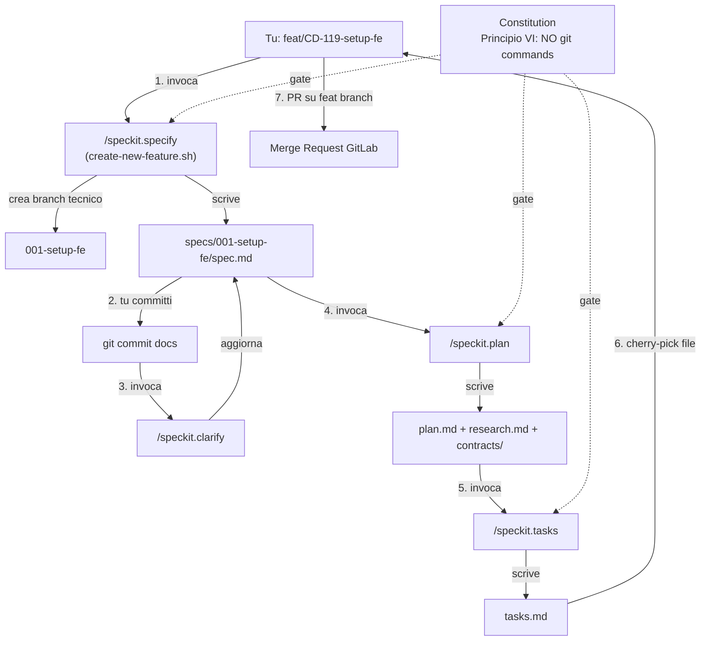

## Strategia in breve

- **Integrazione**: `specify init --here --integration cursor-agent --script sh` → installa `.cursor/skills/speckit-*/SKILL.md` + `.cursor/rules/specify-rules.mdc` + `.specify/` (memory/scripts/templates).
- **Git human-in-the-loop**: nessun override degli script Spec-Kit. La protezione vive **interamente** nella `.specify/memory/constitution.md` come Principio bloccante (mirror del Principio VI locale) + rinforzo in una nuova regola Cursor `.cursor/rules/spec-kit-workflow.mdc`. Convivenza pacifica con il branch tecnico `001-setup-fe` creato da Spec-Kit: l'agent NON committa mai; tu fai cherry-pick/squash sul tuo branch `feat/CD-119-setup-fe` (vedi playbook).
- **Costituzione**: la `.specify/memory/constitution.md` NON duplica i 5 principi I-V autoritativi del submodule, ma li **richiama via reference** a [docs/_context/docs/CONSTITUTION.md](docs/_context/docs/CONSTITUTION.md) e aggiunge i principi locali Spec-Kit-specifici (VI git-isolation, VII submodule read-only, VIII npm-only stack).
- **Pilota CD-119**: ricostruzione retrospettiva di `spec.md` + `plan.md` + `tasks.md` dentro `specs/001-setup-fe/`. NON eseguiamo `/speckit.implement` in questo piano — il piano si ferma alla generazione degli artefatti SDD; l'implementazione vera del setup Next.js è il task successivo (in altra chat o continuazione manuale).

## Decisioni di default che applico (no ulteriore conferma)

- Versione Spec-Kit: `v0.8.11` (latest, 15/05/2026).
- Cartella specs: default `specs/NNN-short-name/` (Spec-Kit nativo). Tracking Jira via metadata frontmatter dentro `spec.md` (campo `jira: CD-119`).
- `.gitignore`: la riga `.cursor/skills/speckit-git-*/` già presente NON la rimuoviamo — ignora solo eventuali skills sperimentali con prefisso `speckit-git-*`; le 6 core skills `speckit-constitution|specify|clarify|plan|tasks|implement` verranno tracciate normalmente.
- README progetto: aggiungo sezione "Sviluppo con Spec-Kit" con quick-reference flow.
- Branch naming Spec-Kit (`001-setup-fe`) coesiste con branch progetto (`feat/CD-119-setup-fe`) — il playbook documenta il workflow di consolidamento.

## Architettura del flusso (mermaid)



## File chiave che verranno creati/modificati

### Da Spec-Kit (auto-generati da `specify init`)

- `.specify/memory/constitution.md` — scaffold vuoto, sovrascriveremo subito con `/speckit.constitution`
- `.specify/scripts/bash/*.sh` — script utility (`create-new-feature.sh`, `setup-plan.sh`, `setup-tasks.sh`, `common.sh`, `check-prerequisites.sh`)
- `.specify/templates/{spec,plan,tasks,checklist,agent-file,commands/*}-template.md`
- `.cursor/skills/speckit-{constitution,specify,clarify,plan,tasks,implement,analyze,checklist,taskstoissues}/SKILL.md`
- `.cursor/rules/specify-rules.mdc` — context file Spec-Kit

### Da me (manuali)

- `.cursor/rules/spec-kit-workflow.mdc` — nuova regola Cursor `alwaysApply: true` che enforce-a il Principio VI git-isolation e linka constitution + playbook
- `.specify/memory/constitution.md` — riscritta via `/speckit.constitution` (8 principi: 5 in reference + 3 locali Spec-Kit)
- `docs/speckit-playbook.md` (NUOVO, fuori submodule) — guida operativa team: come lanciare il flow, mapping branch Spec-Kit → branch progetto, MR template integrato
- [README.md](README.md) — sezione `## Sviluppo con Spec-Kit` (~30 righe) con quick start + link al playbook
- [.gitignore](.gitignore) — append esplicito riga `# Spec-Kit runtime` + verifica che `.specify/` sia tracciato

### Pilota CD-119 retrospettivo

- `specs/001-setup-fe/spec.md` — generato via `/speckit.specify` con copia integrale di description + AC + DoD da [CD-119 Jira](https://neversleep.atlassian.net/browse/CD-119)
- `specs/001-setup-fe/plan.md` — generato via `/speckit.plan` (stack Next.js 14 + TS strict + Tailwind + Shadcn/UI + Vercel)
- `specs/001-setup-fe/tasks.md` — generato via `/speckit.tasks` (task list eseguibile in PR follow-up)

## Snippet chiave — Principio VI Constitution (proposta)

```markdown
## Principle VI: Git Human-in-the-Loop (NON-NEGOTIABLE)

The coding agent MUST NOT execute any of the following git commands at any time
during /speckit.specify, /speckit.plan, /speckit.tasks, or /speckit.implement:
- git commit (in any form, including --amend, --fixup)
- git push (any remote, any branch)
- git merge, git rebase, git cherry-pick
- git reset --hard, git clean
- gh pr create, glab mr create

The agent MAY execute (only when explicitly invoked by Spec-Kit's
create-new-feature.sh during /speckit.specify):
- git checkout -b NNN-short-name (branch creation by Spec-Kit script only)
- git status, git diff, git log (read-only inspection)

All commits, branches feat/CD-XXX-*, merges, pushes, and PR/MR creation are
performed by the human developer (Matteo). The agent presents a status report
at the end of each phase and waits for human action.

Violation of this principle BLOCKS PR merge. Reviewer MUST reject any PR where
agent-authored commits are found in history (use git log --format='%an %ae'
to verify).
```

## Compatibilità con regole workspace esistenti

- [.cursor/rules/chateau-context.mdc](.cursor/rules/chateau-context.mdc) resta invariato — è la regola di project context auto-load (sempre applicata).
- La nuova `spec-kit-workflow.mdc` sarà additiva (non sovrappone), `alwaysApply: false`, `description: "Spec-Kit SDD workflow rules — load when invoking /speckit.* commands"` (auto-load contestuale quando l'agent vede `/speckit.*` nella richiesta).
- Tutte le regole non-negoziabili esistenti (npm 10, no `@ts-ignore`, Conventional Commits + Gitmoji, branch protection main) rimangono autoritative — i template Spec-Kit generati saranno verificati per compliance.

## Cosa NON faremo in questo piano

- NON eseguiamo `/speckit.implement` su CD-119 (il setup Next.js vero verrà fatto in chat/PR dedicata, leggendo il `tasks.md` come guida).
- NON tocchiamo il submodule `docs/_context/` (è read-only, source of truth nel repo `chateau-d-ax-docs`).
- NON override degli script Spec-Kit upstream (`scripts/bash/*.sh`) — minimal divergence per facilitare upgrade futuri.
- NON installiamo extensions community Spec-Kit in questa fase (es. `taskstoissues` per export su Jira — eventualmente in iterazione successiva).

## Rischi e mitigazioni

- **R1 — Agent ignora il Principio VI e committa**: mitigato da (a) regola Cursor `spec-kit-workflow.mdc` che ripete il divieto, (b) review umano obbligatorio in PR, (c) check rapido `git log --format='%an %ae'` prima del merge.
- **R2 — Branch `001-setup-fe` proliferano e creano rumore in GitLab**: NON pushiamo i branch tecnici Spec-Kit; restano locali. Solo il branch `feat/CD-XXX-*` consolidato viene pushato.
- **R3 — Conflitti tra constitution Spec-Kit e Costituzione progetto**: risolto via reference esplicita — Principi I-V autoritativi nel submodule, Principi VI-VIII locali Spec-Kit-specifici. Nessuna sovrapposizione semantica.
- **R4 — Spec-Kit "archiviato 18/05" in [task-list-tech.md](docs/_context/docs/03-planning/task-list-tech.md#L82): il team riscopre divergenza tra doc e realtà**. Mitigazione: aggiungo nota in [docs/speckit-playbook.md](docs/speckit-playbook.md) e committo un bump documentale (eventualmente nel submodule, separato dal repo FE) per chiarire la rinconsiderazione.
