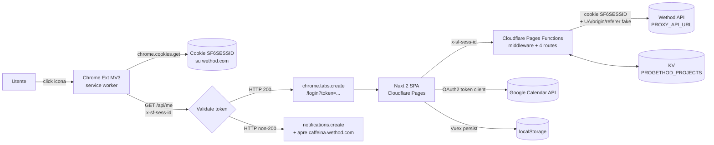
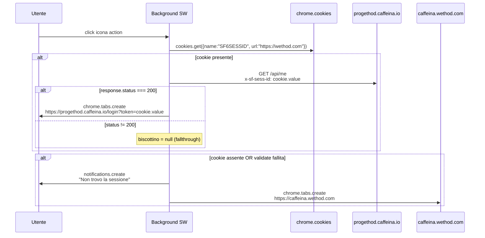
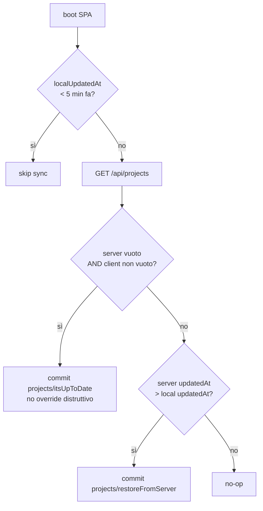
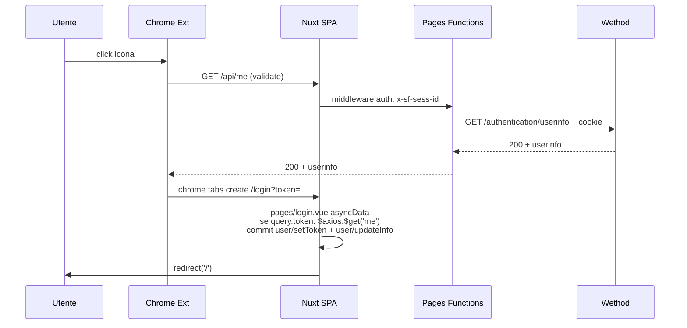
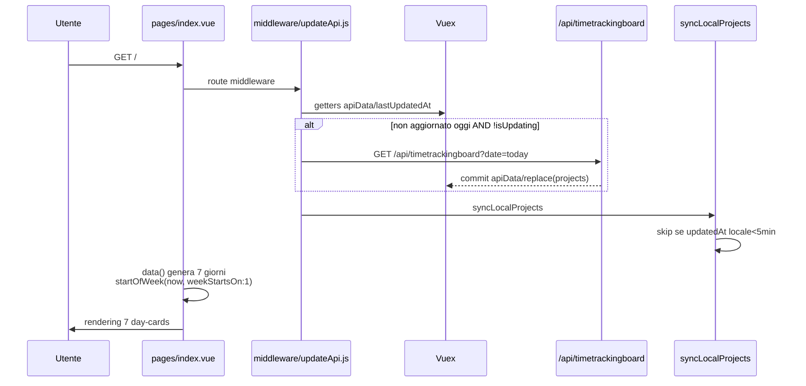
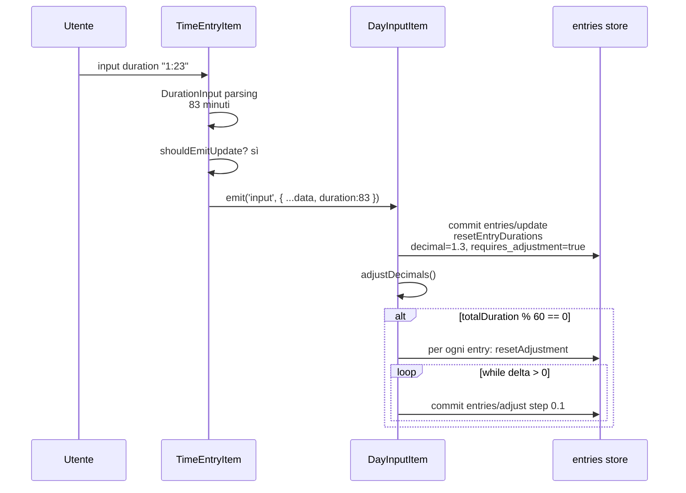
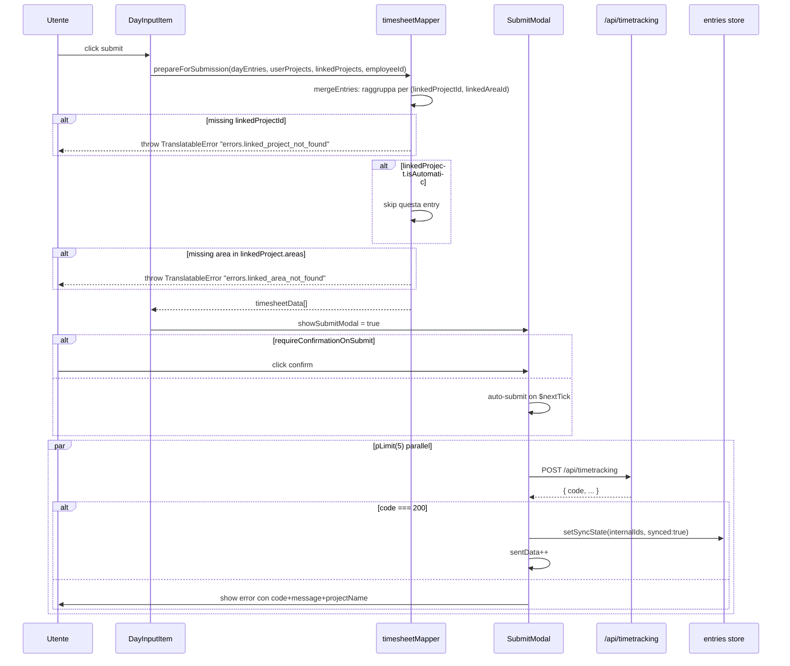
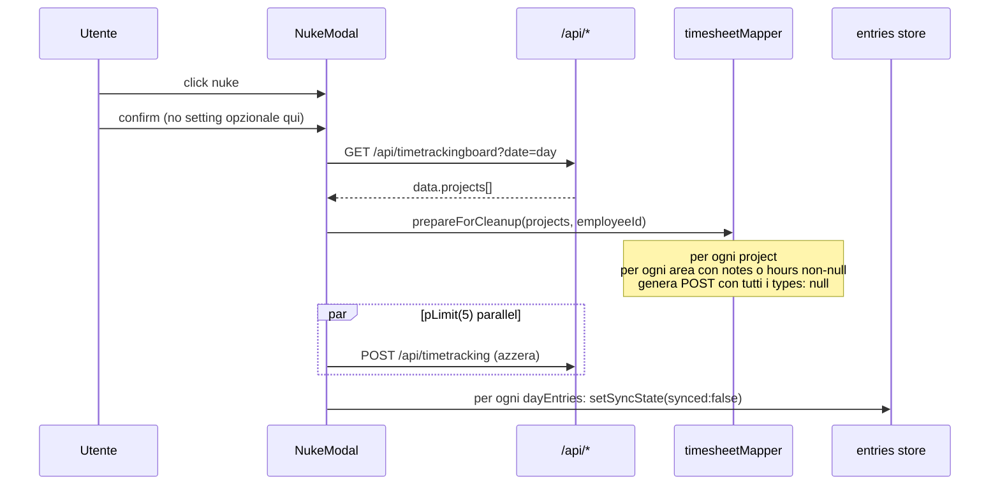
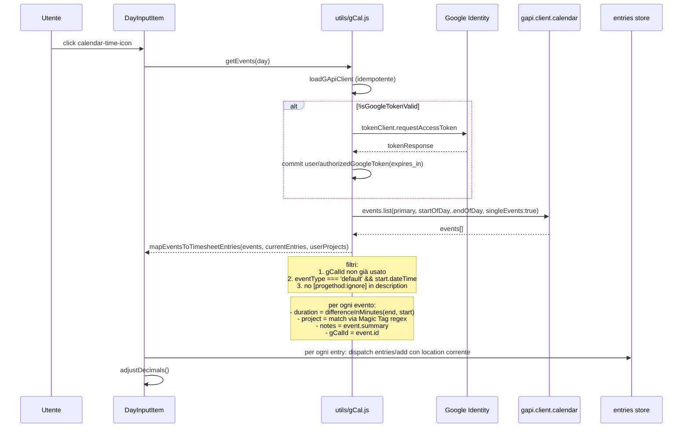
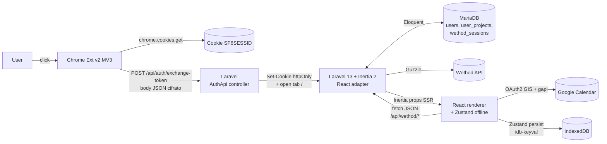

# Refactor Blueprint — progethod → Laravel 13 + Inertia 2 + React

> **Stato**: **Final 1.0** — 22 maggio 2026  
> **Scope**: AS-IS dettagliato dell'app attuale (Nuxt 2 + Cloudflare Pages Functions + KV + Chrome Extension MV3) e mapping concreto verso il target Laravel 13 (PHP 8.5) + Inertia 2.x + React + MariaDB + estensione co-locata.  
> **Lingua**: Italiano.  
> **Audience**: chi rifarà il refactor da zero su nuova repo.  
> **Cosa NON è questo doc**: una spec implementativa con user stories/acceptance criteria, o codice. È una mappa.  
> **Tutte le decisioni aperte sono chiuse** — vedi [§15](#15-decisioni-prese).

---

## Indice

1. [Executive Summary](#1-executive-summary)
2. [Stack & runtime attuali](#2-stack--runtime-attuali)
3. [Diagramma di sistema (AS-IS)](#3-diagramma-di-sistema-as-is)
4. [Contratto Chrome Extension (analisi sorgente)](#4-contratto-chrome-extension-analisi-sorgente)
5. [Contratto con Wethod (esterno)](#5-contratto-con-wethod-esterno)
6. [API interna del proxy (Pages Functions)](#6-api-interna-del-proxy-pages-functions)
7. [Modello dati client (Vuex stores)](#7-modello-dati-client-vuex-stores)
8. [Modello dati server (KV)](#8-modello-dati-server-kv)
9. [Flussi funzionali](#9-flussi-funzionali)
10. [Regole di business non ovvie](#10-regole-di-business-non-ovvie)
11. [UI/UX & componenti](#11-uiux--componenti)
12. [i18n](#12-i18n)
13. [Catalogo bug noti & code smells da NON portare nel refactor](#13-catalogo-bug-noti--code-smells-da-non-portare-nel-refactor)
14. [Mapping al nuovo stack — Laravel 13 + Inertia 2 + React](#14-mapping-al-nuovo-stack--laravel-13-php-85--inertia-2x--react)
15. [Decisioni prese](#15-decisioni-prese)

---

## 1. Executive Summary

**Cos'è progethod**  
Un wrapper minimale su [Wethod](https://wethod.com) — il PSA tool di Caffeina — pensato esclusivamente per **inserire il timesheet settimanale in modo veloce**. L'utente apre l'app, vede la settimana corrente sotto forma di 7 card giornaliere, aggiunge righe (progetto, durata, note, location), preme submit e i dati vengono spinti verso Wethod via un proxy Cloudflare Pages.

**Perché esiste**  
La UI di Wethod per il timesheet è verbosa, lenta e richiede troppi click per voce. progethod offre:
- input minimalista a tabella (un giorno = una tabella di righe)
- arrotondamento automatico in step di `0.1h` per pareggiare al multiplo di 6 minuti richiesto da Wethod
- import da Google Calendar con auto-matching dei progetti via "Magic Tag™️" embedded nelle descrizioni eventi
- offline-first: i dati vivono in `localStorage` e si sincronizzano quando il browser ha connessione

**Modello di trust attuale (importante per il refactor)**  
1. L'utente fa login su `caffeina.wethod.com` (Wethod tenant Caffeina) come normalmente farebbe
2. Installa una **estensione Chrome MV3** dedicata
3. Click su icona estensione → legge il cookie `SF6SESSID` di Wethod, lo passa come `?token=...` al frontend
4. Il frontend salva il token in `localStorage` e lo allega come header `x-sf-sess-id` a ogni chiamata
5. Cloudflare Pages Functions proxy-a verso Wethod aggiungendo il cookie + headers di impersonation browser

Quindi: **niente autenticazione propria**, niente database utenti — l'app vive completamente nella sessione Wethod altrui. Il refactor manterrà la dipendenza dal cookie Wethod ma introdurrà un layer di sessione propria (Sanctum) per evitare di esporre il cookie come query string.

**Vincoli funzionali da preservare nel refactor (non-negoziabili)**
- **Offline-first**: l'utente deve poter inserire entries anche senza connessione e fare submit dopo
- **Magic Tag™️ embedded in Google Calendar**: il pattern `[progethod:<projectId>:(generic|uid_<localId>)]` deve continuare a funzionare nei calendar event dell'utente
- **Auto-adjust decimal duration**: algoritmo di redistribuzione 0.1h descritto in [§10](#10-regole-di-business-non-ovvie)
- **Nuke giornaliero**: la possibilità di cancellare tutto il giorno lato Wethod e re-submittare da progethod
- **Backup/Restore JSON**: download/upload dei dati locali come fallback utente

**Vincoli tecnici da rivedere nel refactor**
- Sostituire `localStorage + token in URL` con cookie httpOnly + session app interna
- Spostare i progetti utente da KV `PROGETHOD_PROJECTS` a tabella DB Laravel
- Pulire le impurità (DOM manipulation diretta, fake pagination, recursive mutation, UA hardcoded)
- Adottare un design system consapevole (la palette indigo/purple attuale è "AI-default")

---

## 2. Stack & runtime attuali

### 2.1 Frontend SPA — Nuxt 2 / Vue 2

| Componente | Versione | Ruolo | Note |
|------------|----------|-------|------|
| Nuxt | 2.15.8 | Framework | **EOL dicembre 2023** — security e bug fix non più garantiti |
| Vue | 2.6.14 | UI | **EOL dicembre 2023** |
| `@nuxtjs/axios` | 5.13 | HTTP client | configurato in [`plugins/axios.js`](../plugins/axios.js) |
| `@nuxtjs/i18n` | 7.2 | i18n | solo locale `it` |
| `@nuxtjs/pwa` | 3.3 | PWA manifest | `manifest.lang: 'en'` (incongruente con i18n it) |
| `@nuxtjs/tailwindcss` | 4.2 | Styling | safelist hardcoded per `bg-red-500/200`, `bg-yellow-500/200` |
| `@nuxtjs/date-fns` | 1.5 | Date helpers | metodi pinned: `format`, `addDays`, `startOfWeek`, `intervalToDuration` |
| `vuex-persist` | 3.1 | Persistenza state | salva su `window.localStorage` con reducer custom |
| `vue-tabler-icons` | 1.0 | Icone | ~30 icone usate |
| `@voerro/vue-tagsinput` | 2.7 | Combobox progetti | a11y debole |
| `vue-select` | 3.18 | Select progetti linkati | a11y debole |
| `p-limit` | 4.0 | Concorrenza submit | limit 5 |
| `uuid` | 8.3 | ID progetti utente | v4 |
| `short-unique-id` | 4.4 | ID entries timesheet | length 10 |

**Configurazione runtime** ([`nuxt.config.js`](../nuxt.config.js)):
- `ssr: false`, `target: 'static'` → output statico deployato su Cloudflare Pages
- Locale default `it`, fallback `it`
- API base URL: `${CF_PAGES_URL}/api/` in dev, `/api/` in prod
- Volta pin: **Node 16.14.2** → EOL Settembre 2023

### 2.2 Backend proxy — Cloudflare Pages Functions

| Componente | Ruolo |
|------------|-------|
| Workers runtime | esecuzione serverless |
| File-based routing | `functions/api/<endpoint>.js` → `/api/<endpoint>` |
| Middleware globale | [`functions/_middleware.js`](../functions/_middleware.js) — order `[options, auth, errorHandler, corsHeaders]` |
| KV namespace `PROGETHOD_PROJECTS` | storage progetti utente per email |
| wrangler 3.14 | dev locale via [`env2Bindings.js`](../env2Bindings.js) |

**Variabili env** ([`.env.example`](../.env.example)):
- `CF_PAGES_URL` — base URL frontend
- `LOGIN_HOST` — host del login Wethod (usato solo per redirect informativi)
- `LOGIN_EXTENSION_URL` — link Chrome Web Store dell'estensione
- `PROXY_API_URL` — host API Wethod (es. `api.caffeina.wethod.com`)
- `PROXY_ORIGIN_URL` — origin Wethod (es. `caffeina.wethod.com`)
- `INSTRUCTION_VIDEO_URL` — video tutorial login
- `GCAL_API_KEY`, `GCAL_CLIENT_ID` — credenziali Google Calendar (lato client)

### 2.3 Estensione Chrome — Manifest V3

| Componente | Dettaglio |
|------------|-----------|
| Versione | 1.0.1 ([`manifest.json`](../estensione_progethod/1.0.1_0/manifest.json)) |
| Manifest version | 3 |
| Background | service worker ([`background.js`](../estensione_progethod/1.0.1_0/background.js), 31 righe) |
| Action | `chrome.action.onClicked` — niente popup UI, solo icona cliccabile |
| Permissions | `scripting` (dichiarata ma **non usata** — vedi [§13](#13-catalogo-bug-noti--code-smells-da-non-portare-nel-refactor)), `cookies`, `notifications` |
| Host permissions | `*://*.wethod.com/`, `*://*.progethod.caffeina.io/` |
| `key` | pinnata in manifest → identità stabile su Chrome Web Store |
| Icone | 16 / 32 / 48 / 128 px |

### 2.4 Integrazioni esterne

- **Wethod API** — 3 endpoint, vedi [§5](#5-contratto-con-wethod-esterno). Auth via cookie `SF6SESSID`.
- **Google Calendar API** — OAuth2 via Google Identity Services (`accounts.google.com/gsi/client`) + `gapi.client.calendar.events.list`. Scope `calendar.readonly`. Vedi [`utils/gCal.js`](../utils/gCal.js).

---

## 3. Diagramma di sistema (AS-IS)



---

## 4. Contratto Chrome Extension (analisi sorgente)

L'estensione vive in [`estensione_progethod/1.0.1_0/`](../estensione_progethod/1.0.1_0/). Questa sezione descrive **il contratto reale** (non dedotto) perché la v2 dell'estensione dovrà essere ricostruita per il nuovo stack.

### 4.1 Manifest ([`manifest.json`](../estensione_progethod/1.0.1_0/manifest.json))

```json
{
  "name": "Progethod",
  "description": "Enable one click login into Progethod",
  "version": "1.0.1",
  "manifest_version": 3,
  "background": { "service_worker": "background.js" },
  "permissions": ["scripting", "cookies", "notifications"],
  "host_permissions": [
    "*://*.wethod.com/",
    "*://*.progethod.caffeina.io/"
  ],
  "action": { "default_icon": { "16": "...", "32": "...", "48": "...", "128": "..." } },
  "icons": { "16": "...", "32": "...", "48": "...", "128": "..." },
  "key": "MIIBIjANBgkqhkiG9w0BAQEFAAOC..."
}
```

**Note**:
- **Niente popup**: l'icona è puramente cliccabile (`chrome.action.onClicked`)
- `key` pinnata garantisce **identità stabile** dell'estensione → necessaria per essere riconoscibile dal backend (oggi non viene fatto, ma è una leva disponibile)
- `update_url: https://clients2.google.com/service/update2/crx` → distribuzione via Chrome Web Store

### 4.2 Flusso runtime ([`background.js`](../estensione_progethod/1.0.1_0/background.js))



### 4.3 Trust & sicurezza (CRITICO)

- Il **token** (cookie Wethod) viene passato **in URL query string** al frontend (`/login?token=...` — vedi [`background.js`](../estensione_progethod/1.0.1_0/background.js) riga 30). Conseguenze:
  - Finisce in **cronologia browser**
  - Finisce nei **log di accesso** del server (Cloudflare Pages, eventuali proxy/CDN)
  - Finisce come `Referer` se la pagina di login fa richieste verso altri domini (es. analytics, CDN font)
  - Visibile a estensioni di terze parti con permission `tabs`
- L'estensione **valida prima di redirect** (buona pratica), ma non riduce il rischio del token-in-URL
- **Nessun secondo fattore**, nessun refresh
- Variabile `biscottino` (= cookie in italiano) — stilistico, non un problema

### 4.4 Domini hardcoded

Hardcoded sia nel manifest (host_permissions) sia nel codice del service worker:

| Dominio | Ruolo |
|---------|-------|
| `https://wethod.com` | sorgente cookie (`chrome.cookies.get`) |
| `https://progethod.caffeina.io` | target frontend (validate + redirect) |
| `https://caffeina.wethod.com` | fallback redirect quando l'utente non ha sessione |

**Implicazione**: l'estensione è **single-tenant Caffeina** per design. Multi-tenant futuro richiede parametrizzazione build-time + nuova distribuzione Web Store.

---

## 5. Contratto con Wethod (esterno)

I 3 endpoint sono chiamati da [`functions/utils/client.js`](../functions/utils/client.js) via `fetch`. La shape documentata qui è quella **osservata nel codice esistente** — non da docs ufficiali Wethod.

### 5.1 Headers richiesti (impersonation completa browser)

`baseRequest()` in [`functions/utils/client.js`](../functions/utils/client.js) righe 1-48 aggiunge sempre:

| Header | Valore |
|--------|--------|
| `authority` | `${env.PROXY_API_URL}` |
| `accept` | `application/json, text/javascript, */*; q=0.01` |
| `accept-language` | `en-GB,en-US;q=0.9,en;q=0.8,it;q=0.7` |
| `cookie` | `SF6SESSID=${authToken};` |
| `dnt` | `1` |
| `origin` | `https://${env.PROXY_ORIGIN_URL}` |
| `referer` | `https://${env.PROXY_ORIGIN_URL}/` |
| `user-agent` | **hardcoded** `Mozilla/5.0 (Macintosh; Intel Mac OS X 10_15_7) AppleWebKit/537.36 (KHTML, like Gecko) Chrome/109.0.0.0 Safari/537.36` |
| `Content-Type` | `application/json` (solo se body presente) |

> **Rischio fragilità**: il UA è fisso a Chrome 109. Wethod potrebbe iniziare a bloccare per fingerprint troppo vecchio.

### 5.2 Endpoint 1 — `GET /authentication/userinfo`

- **Usato da**: [`functions/api/me.js`](../functions/api/me.js) (proxy diretto) e [`functions/api/projects.js`](../functions/api/projects.js) (per ricavare email come chiave KV)
- **Query params**: nessuno
- **Body**: nessuno
- **Risposta osservata** (campi consumati):

```ts
{
  data: {
    usr_id: number,
    employee_id: number,
    email: string,
    name: string,
    surname: string,
    pic: string | null
  }
}
```

### 5.3 Endpoint 2 — `GET /timetrackingboard?date=YYYY-MM-DD`

- **Usato da**: [`functions/api/timetrackingboard.js`](../functions/api/timetrackingboard.js) (proxy con `searchParams` passthrough)
- **Chiamato da**: [`utils/updateApiData.js`](../utils/updateApiData.js) (lista progetti utente) + [`components/NukeTimesheetModal.vue`](../components/NukeTimesheetModal.vue) (per ricostruire stato da azzerare)
- **Risposta osservata**:

```ts
{
  data: {
    projects: Array<{
      project: {
        id: number,
        name: string,
        archived: boolean,
        project_type: { is_timesheet_automatic: boolean }
      },
      areas: Array<{
        id: number | string, // numerico per aree reali, stringa "null" per area generica
        name: string,
        on: boolean,
        notes?: string,
        hours: { internal: number|null, remote: number|null, travel: number|null, overtime: number|null, night_shift: number|null }
      }>,
      date: string // YYYY-MM-DD
    }>
  }
}
```

Vedi parsing in [`utils/updateApiData.js`](../utils/updateApiData.js) righe 12-21 (filtra archived + areas con `on:false`).

### 5.4 Endpoint 3 — `POST /timetracking/`

- **Usato da**: [`functions/api/timetracking.js`](../functions/api/timetracking.js) (proxy con body JSON passthrough)
- **Chiamato da**: [`components/SubmitTimesheetModal.vue`](../components/SubmitTimesheetModal.vue) (submit) e [`components/NukeTimesheetModal.vue`](../components/NukeTimesheetModal.vue) (azzeramento)
- **Body** generato da `prepareForSubmission` ([`utils/timesheetMapper.js`](../utils/timesheetMapper.js) righe 16-48):

```ts
{
  project_id: number,
  employee_id: number,
  date: "YYYY-MM-DD",
  hours: Array<{
    area_id: number | string | null,
    types: {
      internal: number | null,  // decimal hours, multiplo di 0.1
      remote:   number | null,
      travel:   null,           // sempre null dal client
      overtime: null,
      night_shift: null
    },
    notes: string  // "- nota1 *01:30* #abc123\n- nota2 *00:30* #def456"
  }>
}
```

- **Risposta** — il codice client controlla esplicitamente `response.data.code === 200` in [`components/SubmitTimesheetModal.vue`](../components/SubmitTimesheetModal.vue) riga 108. Wethod sembra ritornare 200 HTTP con `{ code, message }` nel body anche per errori applicativi.

---

## 6. API interna del proxy (Pages Functions)

### 6.1 Middleware globale ([`functions/_middleware.js`](../functions/_middleware.js))

Ordine `[options, auth, errorHandler, corsHeaders]` esportato come `onRequest`:

| Middleware | Responsabilità |
|------------|----------------|
| `options` | Risponde alle preflight `OPTIONS` con i CORS headers |
| `auth` | Estrae `x-sf-sess-id` → `data.authToken`. **401** se manca su rotte `/api/*` |
| `errorHandler` | Cattura eccezioni nei handler downstream, ritorna JSON 500 con `{ code, status, message }` |
| `corsHeaders` | Allega header CORS alla response finale (solo se path matcha `/api`) |

CORS implementati in [`functions/utils/cors.js`](../functions/utils/cors.js):
- **Sempre**: `Access-Control-Allow-Headers: Content-Type, x-sf-sess-id`
- **Solo in dev** (`NODE_ENV === 'development'`): `Access-Control-Allow-Origin: *`, `Allow-Methods: GET,HEAD,POST,PUT,OPTIONS`, `Max-Age: 86400`

`JSONResponse` helper in [`functions/utils/response.js`](../functions/utils/response.js) — estende `Response` per JSON automatico.

### 6.2 Route 1 — `GET /api/me` ([`functions/api/me.js`](../functions/api/me.js))

| Aspetto | Dettaglio |
|---------|-----------|
| Metodo | `GET` (handler `onRequestGet`) |
| Auth | `x-sf-sess-id` required (middleware) |
| Input | nessuno |
| Output | proxy passthrough di `authentication/userinfo` |
| Side effects | nessuno |

### 6.3 Route 2 — `GET /api/timetrackingboard` ([`functions/api/timetrackingboard.js`](../functions/api/timetrackingboard.js))

| Aspetto | Dettaglio |
|---------|-----------|
| Metodo | `GET` |
| Query | `date=YYYY-MM-DD` (passthrough) |
| Output | proxy passthrough |

### 6.4 Route 3 — `POST /api/timetracking` ([`functions/api/timetracking.js`](../functions/api/timetracking.js))

| Aspetto | Dettaglio |
|---------|-----------|
| Metodo | `POST` |
| Body | shape di `prepareForSubmission` (vedi [§5.4](#54-endpoint-3--post-timetracking)) |
| Output | proxy passthrough |

### 6.5 Route 4 — `GET/PUT /api/projects` ([`functions/api/projects.js`](../functions/api/projects.js))

**Non è un proxy.** Usa il KV `PROGETHOD_PROJECTS`.

- `GET`:
  1. Recupera email da `/authentication/userinfo`
  2. `env.PROGETHOD_PROJECTS.getWithMetadata(email, 'json')`
  3. Ritorna `{ status: 'ok', projects: projects || [], updatedAt: metadata?.updatedAt }`
- `PUT`:
  1. Recupera email da `/authentication/userinfo`
  2. Legge body `{ projects, updatedAt }`
  3. `env.PROGETHOD_PROJECTS.put(email, JSON.stringify(projects), { metadata: { updatedAt } })`
  4. Ritorna `{ status: 'ok' }`

> **Nota**: `GET` ritorna `{ projects, updatedAt }` ma `PUT` accetta `{ projects, updatedAt }`. La symmetry è incidentale, non garantita dal contratto.

---

## 7. Modello dati client (Vuex stores)

Vuex 3 con 5 moduli namespaced. Persistenza selettiva via [`plugins/vuex-persist.js`](../plugins/vuex-persist.js) → `localStorage`.

### 7.1 `user/` ([`store/user.js`](../store/user.js))

```ts
type UserState = {
  authToken: string | null,        // cookie SF6SESSID
  isTokenExpired: boolean,
  info: {
    usr_id: number, employee_id: number,
    email: string, name: string, surname: string,
    pic: string | null
  },
  hasAuthorizedGCal: boolean,
  googleTokenExpiration: string | null  // ISO date
}
```

**Getters chiave**:
- `canMakeRequests` = `authToken && !isTokenExpired`
- `isGoogleTokenValid` = `googleTokenExpiration && isAfter(parseISO(googleTokenExpiration), now)`

**Mutations**: `setToken`, `updateInfo`, `invalidateToken` (su 401), `authorizedGoogleToken(expiresIn)`.

**Persistito**: `{ authToken, isTokenExpired, info, hasAuthorizedGCal }` (escluso `googleTokenExpiration` — bug? scelta?).

### 7.2 `projects/` ([`store/projects.js`](../store/projects.js)) — progetti utente locali

```ts
type UserProject = {
  id: string,              // uuid v4
  name: string,
  linkedProjectId?: number,  // ID Wethod
  linkedAreaId?: string,     // ID Wethod area, può essere "null" string per area generica
  requiresNotes?: boolean,
  defaultNotes?: string,
  deleted: boolean,
  deletedAt: string | null   // ISO date
}

type ProjectsState = {
  projects: UserProject[],
  updatedAt: string | null   // ISO date — usato per sync
}
```

**Getters**:
- `projects` — tutti
- `visibleProjects` — esclude `deleted === true`

**Actions**: `add(name)` → genera UUID e committa `add`.

**Mutations**: `add`, `update`, `remove` (soft-delete), `restoreBackup`, `restoreFromServer`, `itsUpToDate`.

**Persistito**: filtrato → progetti `deleted` con `deletedAt` > 40gg vengono **scartati al rehydrate** ([`plugins/vuex-persist.js`](../plugins/vuex-persist.js) riga 14).

### 7.3 `apiData/` ([`store/apiData.js`](../store/apiData.js)) — cache progetti Wethod

```ts
type WethodProject = {
  id: number, name: string,
  isAutomatic: boolean,
  areas: Array<{ id: number, name: string }>
}

type ApiDataState = {
  projects: WethodProject[],
  isUpdating: boolean,
  lastUpdatedAt: string  // ISO, default new Date(0).toISOString()
}
```

**Mutations chiave**: `replace(projects)` (set + `lastUpdatedAt = now`), `updateStarted`, `updateEnded`.

**Bug noto**: `remove(id)` usa `state.entries.findIndex` invece di `state.projects.findIndex` ([§13](#13-catalogo-bug-noti--code-smells-da-non-portare-nel-refactor)).

**Persistito**: `{ projects, lastUpdatedAt }`.

### 7.4 `entries/` ([`store/entries.js`](../store/entries.js)) — voci timesheet

```ts
type EntryData = {
  project?: UserProject,
  duration: number,            // minuti interi
  decimal_duration: number,    // 0.1 step (es. 1.5)
  requires_adjustment: boolean,
  adjusted: boolean,
  notes?: string,
  location: 'home' | 'office',
  gCalId?: string              // se importato da Google Calendar
}

type Entry = {
  id: string,                  // short-unique-id length 10
  day: string,                 // "yyyy-MM-dd"
  data: EntryData,
  synced: boolean              // true dopo POST a Wethod
}

type EntriesState = { entries: Entry[] }
```

**Actions**: `add({ day, data })` → genera ID e committa.

**Mutations**: `add`, `update`, `updateLocation`, `adjust(adjustment)` (incrementa decimal_duration in step 0.1, segna `adjusted: true`), `resetAdjustment`, `remove`, `restoreBackup`, `setSyncState({ id, synced })`.

**Helper interno** `resetEntryDurations(data)`:
- `decimal_duration = floor(duration*10/60)/10`
- `requires_adjustment = duration*10 % 60 !== 0`
- `adjusted = false`

**Persistito**: filtrato → entries con `day` > 30gg fa **vengono scartate al rehydrate**.

### 7.5 `preferences/` ([`store/preferences.js`](../store/preferences.js))

```ts
type PreferencesState = {
  requireConfirmationOnSubmit: boolean  // default true
}
```

**Persistito**: completo.

---

## 8. Modello dati server (KV)

**Namespace**: `PROGETHOD_PROJECTS`  
**Binding**: configurato in [`env2Bindings.js`](../env2Bindings.js) → `--kv=PROGETHOD_PROJECTS`

| Aspetto | Valore |
|---------|--------|
| Chiave | email utente (string, da `/authentication/userinfo`) |
| Value | JSON serializzato di `UserProject[]` (stesso shape lato client) |
| Metadata | `{ updatedAt: ISOString }` |
| TTL | nessuno (KV permanente) |

**Strategia sync** ([`utils/syncLocalProjects.js`](../utils/syncLocalProjects.js)):



**Push verso server** ([`plugins/projects-sync.js`](../plugins/projects-sync.js)): subscribe a `store.subscribe` per **ogni** mutation che matchi `/projects\//` **esclusa** `projects/restoreFromServer` → PUT `/api/projects` con `{ projects, updatedAt }`. Last-write-wins.

---

## 9. Flussi funzionali

### F1 — Login & token capture

Coinvolge: estensione Chrome → SPA → middleware proxy → Wethod.



Riferimenti: [`pages/login.vue`](../pages/login.vue) righe 21-33, [`middleware/auth.js`](../middleware/auth.js), [`plugins/axios.js`](../plugins/axios.js) (allega header su tutte le request).

### F2 — Bootstrap settimana corrente



Riferimenti: [`pages/index.vue`](../pages/index.vue) righe 108-114, [`middleware/updateApi.js`](../middleware/updateApi.js), [`utils/updateApiData.js`](../utils/updateApiData.js).

### F3 — Creazione/modifica entry + auto-adjust

L'algoritmo di adjustment vive in [`components/DayInputItem.vue`](../components/DayInputItem.vue) righe 193-230.

**Pseudocodice**:

```
function adjustDecimals(entries):
  totalDuration = sum(e.data.duration for e in entries)
  if totalDuration % 60 != 0: return  // non adjustabile

  resetAllAdjustments(entries)
  provisional = sum(e.data.decimal_duration for e in entries)
  targetDecimal = totalDuration / 60
  delta = targetDecimal - provisional  // multiplo di 0.1

  adjustableEntries = entries
    .filter(e => e.data.requires_adjustment)
    .sortByDurationDesc()

  step = 0.1
  while delta > 0:
    next = adjustableEntries.find(e => !e.adjusted)
    if !next: break  // edge case
    commit('adjust', { id: next.id, adjustment: step })
    delta -= step

  if totalDecimalDuration*60 != totalDuration:
    showError "errors.error_during_adjustment"
```



### F4 — Submit giornaliero

Coinvolge: `prepareForSubmission` + `pLimit(5)` + tracking sync.



Riferimenti: [`components/SubmitTimesheetModal.vue`](../components/SubmitTimesheetModal.vue), [`utils/timesheetMapper.js`](../utils/timesheetMapper.js) righe 16-113.

### F5 — Nuke giornaliero

Cancella **tutti** i dati Wethod del giorno indicato (per recovery da inconsistenza).



L'azzeramento riusa lo stesso endpoint POST `/timetracking/` ma con `types: { internal:null, remote:null, travel:null, overtime:null, night_shift:null }` (vedi [`utils/timesheetMapper.js`](../utils/timesheetMapper.js) `prepareForCleanup` righe 115-153). UX gimmick: video esplosione in loop durante l'invio.

### F6 — Import da Google Calendar



Magic Tag regex: `/\[progethod:([0-9]+):((generic)|(uid_[a-z0-9]+))\]/g` ([`utils/gCal.js`](../utils/gCal.js) riga 82).

### F7 — Gestione progetti utente + linking Wethod

| Azione | Pagina | Mutation |
|--------|--------|----------|
| Lista | [`pages/projects/index.vue`](../pages/projects/index.vue) | n/a (read-only via getter) |
| Crea (inline) | da `TimeEntryItem` tagAdded | `projects/add(name)` action |
| Edit | [`pages/projects/_id.vue`](../pages/projects/_id.vue) | `projects/update` su click "save" |
| Delete | da lista projects (dropdown) | `projects/remove` (soft) |

L'edit consente di:
- linkare a progetto Wethod (`linkedProjectId`)
- linkare ad area Wethod (`linkedArea`)
- toggle `requiresNotes`
- impostare `defaultNotes`
- copiare il Magic Tag™️ generato dinamicamente: `` `[progethod:${linkedProjectId}:${linkedAreaId || 'generic'}]` ``

### F8 — Backup/Restore JSON locale

[`utils/backupRestore.js`](../utils/backupRestore.js) + chiamato da [`layouts/default.vue`](../layouts/default.vue) (menu profilo).

- **Backup**: snapshot di `{ projects, entries }` → File JSON → download via `URL.createObjectURL` + click programmatico
- **Restore**: input file hidden → `FileReader.readAsText` → JSON parse → `projects/restoreBackup` + `entries/restoreBackup`

> **Quirk**: dopo restore, `updatedAt` di `projects` viene impostato a `now()`, triggerando sync push verso server.

### F9 — Sync progetti col server

Vedi [§8](#8-modello-dati-server-kv) per il diagramma del pull. Il push avviene su **ogni mutation** di `projects/*` (esclusa `restoreFromServer` per evitare loop) — [`plugins/projects-sync.js`](../plugins/projects-sync.js).

---

## 10. Regole di business non ovvie

Queste regole sono **invarianti funzionali** da preservare nel refactor. Ognuna è citata col file:line di provenienza.

### 10.1 Conversione duration → decimal_duration

In Wethod il timesheet è in **decimali multipli di 0.1h** (es. `1.5`). progethod gestisce internamente i **minuti interi** (`duration`) e li converte.

```js
// utils/duration.js:4
getDecimalDuration(duration) = duration ? Math.floor(duration * 10 / 60) / 10 : 0
```

- `60min` → `1.0`
- `66min` → `1.1` (con `requires_adjustment: true` perché 66 non è multiplo di 6)
- `90min` → `1.5`

```js
// utils/duration.js:8
durationRequiresAdjustment(duration) = duration && (duration * 10 % 60 !== 0)
```

### 10.2 Auto-adjust delle ore decimali

Algoritmo dettagliato in [§F3](#f3--creazionemodifica-entry--auto-adjust). Vincoli:

- **Triggera solo se** `totalDuration % 60 === 0` ([`components/DayInputItem.vue`](../components/DayInputItem.vue) riga 202)
- Distribuisce il delta in step da `0.1h` sulle entries con `requires_adjustment`
- Ordina per **durata decrescente** ([`components/DayInputItem.vue`](../components/DayInputItem.vue) riga 213) — chi ha più tempo assorbe per primo l'arrotondamento
- Se dopo l'adjustment `totalDecimalDuration * 60 != totalDuration` → mostra alert `errors.error_during_adjustment`
- Se `totalDuration % 60 != 0` e `>= dayDuration (480min)` → mostra alert `errors.total_not_adjustable` ([`components/DayInputItem.vue`](../components/DayInputItem.vue) righe 155-157)

### 10.3 Linking ai progetti Wethod

Una entry può essere submittata **solo se**:

1. `entry.data.project` esiste e ha `linkedProjectId` definito ([`utils/timesheetMapper.js`](../utils/timesheetMapper.js) righe 57-59)
2. Il `linkedProject` esiste ancora in `apiData.projects` ([`utils/timesheetMapper.js`](../utils/timesheetMapper.js) righe 61-65)
3. Il `linkedArea` (anche `"null"` per area generica) esiste in `linkedProject.areas` ([`utils/timesheetMapper.js`](../utils/timesheetMapper.js) righe 71-73)
4. `linkedProject.isAutomatic === false` (i progetti automatici di Wethod sono **skippati** silenziosamente — [`utils/timesheetMapper.js`](../utils/timesheetMapper.js) righe 67-69)

Violazioni di 1/2/3 sollevano `TranslatableError` ([`utils/localizableErrors.js`](../utils/localizableErrors.js)) con chiave i18n.

### 10.4 `convertAreaId` quirk

Le aree Wethod possono avere ID numerico o stringa `"null"` (per area generica). [`utils/timesheetMapper.js`](../utils/timesheetMapper.js) righe 4-14:

```js
convertAreaId(areaId):
  if !areaId or areaId === 'null': return null
  if areaId matches /^[0-9]+$/: return parseInt(areaId)
  return areaId
```

### 10.5 Location → bucket Wethod

[`utils/timesheetMapper.js`](../utils/timesheetMapper.js) righe 95-102:

| `location` lato client | Bucket Wethod |
|------------------------|---------------|
| `"office"` | `internal` |
| `"home"` | `remote` |
| (default/altro) | `remote` |

I bucket `travel`, `overtime`, `night_shift` sono **sempre `null`** dal client. La UI non li espone.

### 10.6 Aggregazione notes per area

Quando più entries dello stesso giorno collassano sulla stessa `(projectId, areaId)`, le note vengono concatenate:

```js
// utils/timesheetMapper.js:104
area.notes.push(`- ${data.notes || '%'} *${minutesToHHmm(data.duration)}* #${id}`)
```

Output finale (newline-joined):
```
- riunione standup *00:15* #abc1234567
- review PR *01:00* #def8901234
- % *00:30* #ghi5678901
```

Il carattere `%` è il placeholder se nota assente. `#<id>` è l'ID locale dell'entry — usato per debug/audit.

### 10.7 Magic Tag™️

Pattern regex: `\[progethod:([0-9]+):((generic)|(uid_[a-z0-9]+))\]` ([`utils/gCal.js`](../utils/gCal.js) riga 82).

- `[progethod:42:generic]` → linkedProjectId=42, linkedAreaId=null
- `[progethod:42:uid_abc123]` → linkedProjectId=42, linkedAreaId="uid_abc123"
- `[progethod:ignore]` → l'evento viene **escluso** dall'import ([`utils/gCal.js`](../utils/gCal.js) riga 104)

Generato lato UI in [`pages/projects/_id.vue`](../pages/projects/_id.vue) riga 159 e copiabile via clipboard.

### 10.8 Filtri Google Calendar

Nell'import ([`utils/gCal.js`](../utils/gCal.js) righe 97-110):

1. **Esclusi** eventi già importati (match su `gCalId`)
2. **Esclusi** all-day events (richiede `start.dateTime`)
3. **Esclusi** eventi con `eventType !== 'default'` (esclude focus time, out-of-office)
4. **Esclusi** eventi con `[progethod:ignore]` nella description

### 10.9 Concorrenza submit

[`components/SubmitTimesheetModal.vue`](../components/SubmitTimesheetModal.vue) riga 34: `const limit = pLimit(5)` → max 5 POST `/api/timetracking` in parallelo. Stesso pattern in [`components/NukeTimesheetModal.vue`](../components/NukeTimesheetModal.vue) riga 54.

### 10.10 Retention locale al rehydrate

[`plugins/vuex-persist.js`](../plugins/vuex-persist.js):
- **Progetti** `deleted: true` con `deletedAt` > 40 giorni fa → **scartati** (riga 14)
- **Entries** con `day` > 30 giorni fa → **scartate** (riga 18)

### 10.11 Sync server smart (anti-distruttivo)

[`utils/syncLocalProjects.js`](../utils/syncLocalProjects.js):
- Skip se `localUpdatedAt` è **meno di 5 minuti fa** (riga 7)
- **Se server vuoto e client non vuoto**: NON sovrascrivere. Marca `itsUpToDate` (riga 15-18). Protegge da regressioni accidentali su nuovo dispositivo.
- Altrimenti: se `updatedAt` server > locale → `restoreFromServer`

### 10.12 Auto-add riga vuota su submit ultima riga

[`components/DayInputItem.vue`](../components/DayInputItem.vue) `handleSubmit` riga 188:

```js
if (entryIndex === entries.length - 1) {
  this.addEntry()
}
```

Quando l'utente preme Enter sull'ultima riga di un giorno, una riga vuota viene aggiunta automaticamente per fluidità.

### 10.13 Required notes & default notes

In [`components/TimeEntryItem.vue`](../components/TimeEntryItem.vue):

- **Riga 138**: se il progetto utente ha `defaultNotes` e l'entry non ha ancora note, pre-compila al tag-added
- **Righe 192-196**: se `project.requiresNotes` e `!notes` → focus su input notes (intercetta submit)

### 10.14 Auto-focus next field

UX di "tab implicito":

- Mounted di `TimeEntryItem` senza progetto → focus su tagsinput ([`components/TimeEntryItem.vue`](../components/TimeEntryItem.vue) riga 128)
- Dopo tag-added → focus su duration (riga 144)
- Submit con `requiresNotes` non valorizzata → focus su notes (riga 194)

### 10.15 Token Wethod scaduto → soft logout

[`plugins/axios.js`](../plugins/axios.js):

```js
$axios.onError(err => {
  if (err.response?.status === 401) store.commit('user/invalidateToken')
})
```

`authToken` **resta nello store** (non si fa logout duro). La UI mostra l'alert "Sessione scaduta" e invita a rifare il flusso estensione. Permette di non perdere il lavoro in corso.

### 10.16 Day duration constant

`const dayDuration = 60 * 8 = 480 minuti` ([`components/DayInputItem.vue`](../components/DayInputItem.vue) riga 114). Usato solo per l'alert "totale non adjustabile". **Non vincola** il valore inseribile (l'utente può fare > 8h).

### 10.17 DurationInput parser permissivo

[`components/DurationInput.vue`](../components/DurationInput.vue) righe 51-80. Input utente → minuti:

| Input | Parsed |
|-------|--------|
| `"7"` | 420 (7 * 60) — `<10` interpretato come ore |
| `"15"` | 15 — `>=10` interpretato come minuti |
| `"730"` | regex `\d{1,2}\d{2}` → 7h30 = 450 |
| `"7:30"` | 450 |
| `"7.30"` | 450 (regex tollerante `:?`) |
| `"abc"` | 0 |

### 10.18 ISO date come "yyyy-MM-dd" per `day`

Le entries usano la chiave `day = $dateFns.format(date, 'yyyy-MM-dd')` ([`components/DayInputItem.vue`](../components/DayInputItem.vue) riga 141). **Timezone-agnostic** rispetto all'ora di salvataggio, ma deps from local timezone al momento del `format`.

---

## 11. UI/UX & componenti

### 11.1 Pagine

| Path | Layout | Auth | Note |
|------|--------|------|------|
| [`/`](../pages/index.vue) | default | `auth` middleware | render 7 day-cards della settimana corrente |
| [`/projects`](../pages/projects/index.vue) | default | `auth` | tabella progetti utente |
| [`/projects/:id`](../pages/projects/_id.vue) | default | `auth` | form edit progetto |
| [`/login`](../pages/login.vue) | default | — | istruzioni installazione estensione + handler `?token=` |

Layout unico [`layouts/default.vue`](../layouts/default.vue): navbar con logo, link Timesheet/Projects, badge status (`Loader` / `CircleCheck` / `CircleX`), dropdown utente con backup/restore/update-projects.

### 11.2 Catalogo componenti

| Componente | Responsabilità | Props (input) | Eventi (output) |
|------------|----------------|---------------|-----------------|
| [`Alert.vue`](../components/Alert.vue) | banner warning/error con icona | `message:string`, `level:'warning'\|'error'` | — |
| [`Modal.vue`](../components/Modal.vue) | modale fullscreen overlay, slot content | `value:boolean` (v-model) | `input(boolean)` |
| [`ProgressBar.vue`](../components/ProgressBar.vue) | barra di progresso lineare 0-100 | `fill:number` | — |
| [`DurationInput.vue`](../components/DurationInput.vue) | input minuti con parser flessibile | `value:number` (minuti), `disabled:boolean` | `input(min)`, `userSubmit` |
| [`LocationInput.vue`](../components/LocationInput.vue) | toggle home/office | `value:'home'\|'office'`, `disabled:boolean` | `input(loc)` |
| [`TimeEntryItem.vue`](../components/TimeEntryItem.vue) | una riga timesheet (project + duration + notes + decimal + location) | `value:EntryData`, `disabled:boolean` | `input(data)`, `userSubmit` |
| [`DayInputItem.vue`](../components/DayInputItem.vue) | una card-giorno (header + tabella entries + add/calendar buttons + submit/nuke) | `day:Date` | — |
| [`SubmitTimesheetModal.vue`](../components/SubmitTimesheetModal.vue) | modale conferma + progress + invoca POST | `value:bool`, `timesheetData:Array` | `input(bool)` |
| [`NukeTimesheetModal.vue`](../components/NukeTimesheetModal.vue) | modale conferma + GET+POST cleanup + video esplosione | `value:bool`, `dayEntries:Array`, `day:string` | `input(bool)` |

### 11.3 Sistema di griglia entries

[`components/DayInputItem.vue`](../components/DayInputItem.vue) righe 291-298 — CSS Grid Template:

```css
grid-template-columns:
  [warn] 2rem
  [project] 14rem
  [duration] 4rem
  [notes] auto
  [decimal] 2rem
  [adjustment] 1.5rem
  [location] 5rem
  [delete] 3rem;
```

Ogni `TimeEntryItem` rende `<div class="contents">` per "appiattirsi" nella griglia parent.

### 11.4 Tema visivo (AS-IS)

- Palette **indigo/purple-dominante** (`bg-indigo-700`, `hover:bg-indigo-600`, `text-indigo-700`)
- Background grigio (`bg-gray-200`)
- Card bianche con shadow leggera
- Dark mode declarations ovunque (`dark:bg-gray-800` etc.) ma **mai attivate** — codice morto

> **AI aesthetic risk** (skill `frontend-ui-engineering`): la combo indigo+purple+gray+rounded è il default "AI-flavored". Il refactor deve adottare una palette legata al brand Caffeina e ridurre l'uso indiscriminato di indigo.

### 11.5 Accessibilità — stato attuale

- Pochi `aria-label` (giusto su menu icons e logo)
- **Nessun focus trap** nei modali ([`components/Modal.vue`](../components/Modal.vue))
- **Dropdown profilo** nascosto via classe `hidden` e mostrato con `classList.toggle` ([`layouts/default.vue`](../layouts/default.vue) `dropdownHandler` riga 392) — niente `aria-expanded`, niente focus management
- **Menu mobile** stessa pattern — non keyboard-friendly
- Tabsinput e select non semantici (basano su div+input invisibili)

Da considerare **zero a11y baseline** — il refactor deve passare WCAG 2.1 AA.

---

## 12. i18n

- Solo locale `it` ([`locales/it.json`](../locales/it.json)), fallback `it` ([`nuxt.config.js`](../nuxt.config.js) riga 104)
- 58 chiavi totali
- Sezione `errors.*` annidata (i punti di interpolazione: `{project}`, `{code}`, `{message}`)
- `TranslatableError` ([`utils/localizableErrors.js`](../utils/localizableErrors.js)) usa la message come **chiave i18n**, e expone `errorData` come oggetto di interpolazione

### Stringhe da pulire nel refactor

| Chiave | Issue |
|--------|-------|
| `errors.error_during_adjustment` | "prolema" invece di "problema" |
| `submit_timesheet_warning` | "incinsistente" invece di "inconsistente", "radiattivo" invece di "radioattivo" |
| `nuke_timesheet_warning` | "Quest'operazione" (correggere apostrofo se necessario) |

### Stringhe da estrarre (oggi inline)

- "Progethod" nel logo navbar
- "Magic Tag™️" — termine di dominio, va in catalogo brand
- Saluti "Active", "Trending", "Started on..." in [`pages/index.vue`](../pages/index.vue) (sono in `invisible` ma presenti nel DOM)

---

## 13. Catalogo bug noti & code smells da NON portare nel refactor

> Questa sezione è critica: "non perdere dettagli" significa anche **sapere cosa lasciare indietro**. Il refactor è l'occasione per consolidare il debt accumulato.

### 13.1 Bug funzionali

#### B1 — `apiData/remove` mutation rotta

📁 [`store/apiData.js`](../store/apiData.js) riga 27

```js
remove (state, id) {
  state.projects.splice(state.entries.findIndex(p => p.id === id), 1)
  //                          ^^^^^^^ wrong store!
}
```

`state.entries` non esiste in questo modulo. Mutation **mai chiamata** in produzione, quindi non emerge. Codice morto da rimuovere.

#### B2 — `updateOrphanedProjects` vuota

📁 [`utils/updateApiData.js`](../utils/updateApiData.js) riga 33

```js
function updateOrphanedProjects () {
  // intentionally empty
}
```

Dichiarata, chiamata in `updateApiData`, ma vuota. Significa che progetti utente con `linkedProjectId` che non esiste più su Wethod **non vengono notificati né puliti**.

#### B3 — Apparente ricorsione infinita in `DayInputItem.removeEntry`

📁 [`components/DayInputItem.vue`](../components/DayInputItem.vue) righe 178-182

```js
methods: {
  // ...
  removeEntry (id) {
    this.removeEntry(id)        // sembra ricorsione su se stesso
    this.adjustDecimals()
  },
  // ...
  ...mapMutations({
    removeEntry: 'entries/remove'  // spread DOPO → override
  })
}
```

Funziona solo perché lo spread di `mapMutations` è **sintatticamente dopo** la dichiarazione locale → l'object property `removeEntry` viene sovrascritta dal mutation. **Trappola di leggibilità**: chi legge il codice top-down vede una ricorsione che invece chiama un mutation Vuex.

#### B4 — Paginazione fake

📁 [`pages/projects/index.vue`](../pages/projects/index.vue) righe 71-72, 357

```html
<p id="page-view">Viewing 1 - 20 of 60</p>
```

```js
switch (this.$data.temp) {
  case 0: text.innerHTML = 'Viewing 1 - 20 of 60'; break
  case 1: text.innerHTML = 'Viewing 21 - 40 of 60'; break
  case 2: text.innerHTML = 'Viewing 41 - 60 of 60'
}
```

Hardcoded, nessun dato reale. La tabella mostra **tutti** i progetti, sempre.

### 13.2 Smells UI / accessibilità

#### S1 — Manipolazione DOM diretta in [`layouts/default.vue`](../layouts/default.vue)

```js
dropdownHandler(event) {
  const single = event.currentTarget.getElementsByTagName('ul')[0]
  single.classList.toggle('hidden')
}
```

Pattern jQuery-esque in app reactive. Da sostituire con state Vue/React.

#### S2 — `text.innerHTML = '…'` e simili in [`pages/projects/index.vue`](../pages/projects/index.vue) `pageView`, `checkAll`, `tableInteract`

XSS-prone se mai prendesse user input (oggi non lo fa, ma la pattern è da evitare).

#### S3 — Checkbox `invisible`

📁 [`pages/projects/index.vue`](../pages/projects/index.vue) righe 145, 164

```html
<input type="checkbox" class="invisible cursor-pointer ...">
```

Logica di selezione presente ma resa invisibile. Probabilmente un'idea abbandonata. Da rimuovere o completare nel refactor.

#### S4 — Dropdown profilo con `mt-64 hidden`

📁 [`layouts/default.vue`](../layouts/default.vue) riga 80

```html
<ul class="p-2 w-40 ... absolute ... mt-64 hidden">
```

Anti-pattern: dropdown nascosto via margin enorme + classe `hidden`. Da sostituire con portal/popover accessibile.

### 13.3 Smells sicurezza / robustezza

#### Sec1 — Token in URL query string

📁 [`estensione_progethod/1.0.1_0/background.js`](../estensione_progethod/1.0.1_0/background.js) riga 30

```js
chrome.tabs.create({ url: `https://progethod.caffeina.io/login?token=${biscottino.value}` })
```

Cookie Wethod passato come `?token=` → cronologia, log, referrer. **Critical** da risolvere nel refactor (vedi [§14.5](#145-chrome-extension-v20-mapping)).

#### Sec2 — User-Agent impersonation hardcoded

📁 [`functions/utils/client.js`](../functions/utils/client.js) riga 10

UA fisso Chrome 109 Mac OS 10_15_7. Wethod può iniziare a bloccare per fingerprint outdated.

#### Sec3 — CORS permissivi

📁 [`functions/utils/cors.js`](../functions/utils/cors.js)

`Access-Control-Allow-Headers` sempre `*` su qualsiasi origin. Mitigato dal fatto che l'auth richiede token, ma da stringere.

#### Sec4 — Permission `scripting` dichiarata ma non usata

📁 [`estensione_progethod/1.0.1_0/manifest.json`](../estensione_progethod/1.0.1_0/manifest.json) riga 25

`"permissions": ["scripting", "cookies", "notifications"]` — `scripting` non viene mai usata. Viola "minimum privilege" e può rallentare l'install review su Chrome Web Store.

#### Sec5 — Domini hardcoded estensione

Manifest `host_permissions` + `background.js` referenziano direttamente `wethod.com`, `progethod.caffeina.io`, `caffeina.wethod.com`. Single-tenant per design.

### 13.4 Smells lifecycle / DX

#### L1 — `requestAccessToken({ prompt: '' })` opaco

📁 [`utils/gCal.js`](../utils/gCal.js) riga 25

Empty prompt = no consent UI se token già presente. OK per UX ma errore opaco se token mancante.

#### L2 — Zero test

Nessun file `.test.` / `.spec.` / `__tests__/` nel repo. La logica di `timesheetMapper`, `adjustDecimals`, `mapEventsToTimesheetEntries` è non triviale e merita unit test.

#### L3 — Volta pin Node 16

📁 [`package.json`](../package.json) riga 46 — Node 16.14.2 EOL settembre 2023.

#### L4 — Nuxt 2 / Vue 2 EOL

Framework non più manutenuti. Da migrare prima possibile (motivazione del refactor).

#### L5 — Codice morto dark mode

Centinaia di classi `dark:*` mai attivate (nessun `dark` class root, nessun toggle). Da rimuovere o portare a una vera implementazione.

#### L6 — `pages/index.vue` HTML markup invisible

Lista `<ul>` con "Active / Trending / Started on 29 Jan 2020" marcata `invisible` ma presente nel DOM. Da rimuovere.

---

## 14. Mapping al nuovo stack — Laravel 13 (PHP 8.5) + Inertia 2.x + React

### 14.0 Decisioni confermate (stack lockato)

Tutte le scelte aperte sono state chiuse. Il refactor parte da queste invarianti:

| Area | Decisione |
|------|-----------|
| Backend | **Laravel 13** + **PHP 8.5** |
| Renderer | **Inertia 2.x** con adapter ufficiale React |
| Frontend | **React 18+** + **Vite** + **TypeScript** (dallo starter `laravel new --react`) |
| Database | **MariaDB** (no Postgres, no MySQL) |
| Persistenza locale offline-first | **IndexedDB** (via `idb-keyval` adapter per Zustand) |
| Multi-tenancy | **Single-tenant rigido** (nessun `tenant_id`, dominio fisso) |
| Audit log timesheet | **NON pervenuto** in MVP (nessun model `TimesheetSubmission`) |
| Submit concorrenza | **`p-limit` lato client** (mantieni pattern AS-IS, niente endpoint `/batch` server-side) |
| User-Agent verso Wethod | **Parametrico via `config/wethod.php`** con default un UA recente (Chrome 130+) |
| Error surface | **Normalizzato** `{ error: { code, message, details? } }` |
| Magic Tag™️ format | **Mantieni** `[progethod:<projectId>:(generic\|uid_<id>)]` |
| Backup utente | **Client-only** (formato JSON identico ad AS-IS) |
| Dark mode | **Pulire codice morto**, valutare implementazione post-MVP |
| Refresh `WethodSession` | **Post-MVP** (validate solo on-demand alla prima request che fallisce 401) |
| **Test strategy** | Stack approvato (**Pest + Vitest + Playwright**) ma **fuori scope MVP** — riferimento in [§14.7](#147-test-strategy) per Phase 2 |
| Repo estensione Chrome | **Stessa repo Laravel**, sorgente in `/extension/` a livello root |
| Hosting / CI | Out of scope di questo doc (gestito dal team Caffeina) |

### 14.1 Architettura runtime target



### 14.2 Backend Laravel 13

#### 14.2.1 Models (Eloquent)

```
User                    auth dell'app (Sanctum stateful)
├─ id (BIGINT UNSIGNED), email (UNIQUE), name, surname, pic
├─ wethod_user_id (INT), wethod_employee_id (INT)
├─ created_at, updated_at, last_login_at

WethodSession           credenziale verso Wethod
├─ id (BIGINT UNSIGNED), user_id (FK)
├─ session_token (encrypted TEXT)    // ex cookie SF6SESSID
├─ last_validated_at, expires_at (best-effort, nullable)
├─ created_at, updated_at

UserProject             ex KV PROGETHOD_PROJECTS
├─ id (CHAR(36) UUID), user_id (FK)
├─ name, linked_project_id (INT Wethod), linked_area_id (VARCHAR|null)
├─ requires_notes (BOOLEAN), default_notes (TEXT|null)
├─ created_at, updated_at, deleted_at (soft-delete, retention 40gg)
```

**Note**:
- **Solo 3 model** in MVP: `User`, `WethodSession`, `UserProject`. **Niente audit log** (`TimesheetSubmission` rinviato post-MVP) — i submit verso Wethod non vengono persistiti server-side.
- **Entries timesheet client-only**: non vivono nel DB server, restano in Zustand+IndexedDB per offline-first. Backup utente (JSON download/upload) è l'unico canale di recovery in MVP.
- `wethod_user_id` + `wethod_employee_id` cached su `User` al primo login per evitare round-trip a Wethod ad ogni request.
- **Single-tenant**: nessuna colonna `tenant_id` su nessuna tabella. Se in futuro servisse multi-tenancy, si aggiunge con migration additiva.

#### 14.2.2 Services

```php
namespace App\Services;

class WethodClient {
  // Wrappa Guzzle. UA + headers e impersonation interamente da config/wethod.php
  // (vedi 14.2.2.1) — niente hardcoded nel codice.
  public function userInfo(string $sessionToken): WethodUserInfo
  public function timetrackingBoard(string $sessionToken, string $date): WethodBoard
  public function submitTimetracking(string $sessionToken, TimesheetPayload $payload): WethodResponse
}

class TimesheetMapper {
  // Port di utils/timesheetMapper.js
  public function prepareForSubmission(array $dayEntries, array $userProjects, array $wethodProjects, int $employeeId): array
  public function prepareForCleanup(array $wethodProjects, int $employeeId): array
}

class DurationCalculator {
  // Port di utils/duration.js
  public function getDecimalDuration(int $minutes): float
  public function requiresAdjustment(int $minutes): bool
  public function minutesToHHmm(int $minutes): string
}
```

> **Test**: la strategia (Pest + Vitest + Playwright) è approvata ma **fuori scope MVP**. I Service sopra restano comunque pure-function nel design proprio per essere facilmente testabili in Phase 2. Vedi [§14.7](#147-test-strategy).

##### 14.2.2.1 `config/wethod.php` — parametri impersonation

Tutti i valori AS-IS oggi hardcoded in [`functions/utils/client.js`](../functions/utils/client.js) diventano configurabili. Default un browser desktop recente per ridurre il rischio di fingerprint banning:

```php
<?php
// config/wethod.php
return [
  'api_url'     => env('WETHOD_API_URL', 'https://api.caffeina.wethod.com'),
  'origin_url'  => env('WETHOD_ORIGIN_URL', 'https://caffeina.wethod.com'),
  'cookie_name' => env('WETHOD_COOKIE_NAME', 'SF6SESSID'),

  'impersonation' => [
    // Default: un UA recente. Aggiornabile via .env senza rebuild.
    'user_agent'      => env('WETHOD_USER_AGENT', 'Mozilla/5.0 (Macintosh; Intel Mac OS X 14_5) AppleWebKit/537.36 (KHTML, like Gecko) Chrome/130.0.0.0 Safari/537.36'),
    'accept_language' => env('WETHOD_ACCEPT_LANGUAGE', 'it-IT,it;q=0.9,en;q=0.8'),
  ],

  'http' => [
    'timeout'         => env('WETHOD_HTTP_TIMEOUT', 15),
    'connect_timeout' => env('WETHOD_HTTP_CONNECT_TIMEOUT', 5),
  ],
];
```

#### 14.2.3 Routes (split logico)

**Rotte Inertia** (pagine, ritornano `Inertia::render(...)`):

| Verb | Path | Controller | React page |
|------|------|------------|------------|
| GET | `/` | `TimesheetController@index` | `Timesheet/Week` |
| GET | `/projects` | `ProjectsController@index` | `Projects/List` |
| GET | `/projects/{uuid}` | `ProjectsController@edit` | `Projects/Edit` |
| POST | `/projects` | `ProjectsController@store` | redirect |
| PUT | `/projects/{uuid}` | `ProjectsController@update` | redirect |
| DELETE | `/projects/{uuid}` | `ProjectsController@destroy` | redirect |
| GET | `/login` | `AuthController@showLogin` | `Auth/Login` |
| POST | `/logout` | `AuthController@logout` | redirect |

**Rotte API JSON** (REST, chiamate runtime da React via fetch o dall'estensione):

| Verb | Path | Controller | Note |
|------|------|------------|------|
| POST | `/api/auth/exchange-token` | `Api\AuthApiController@exchange` | accetta cookie Wethod nel body, emette session cookie httpOnly |
| GET | `/api/me` | `Api\MeApiController@show` | per estensione validate |
| GET | `/api/wethod/timetrackingboard` | `Api\WethodApiController@board` | query `date=YYYY-MM-DD`, proxy normalizzato |
| POST | `/api/wethod/timetracking` | `Api\WethodApiController@submit` | singola entry. Concorrenza gestita **client-side via `p-limit(5)`** (decisione: mantieni pattern AS-IS, niente batch endpoint in MVP) |

#### 14.2.4 Middleware

| Middleware | Applicato a | Responsabilità |
|------------|-------------|----------------|
| `auth.app` (Sanctum) | tutte le rotte Inertia tranne `/login` | session cookie httpOnly |
| `wethod.session` | tutte le rotte `/api/wethod/*` | verifica `WethodSession` esiste e non scaduta |
| `throttle:wethod` | rotte `/api/wethod/*` | rate-limit per evitare abuse Wethod |
| `web` standard | tutte | CSRF, encrypted cookies, etc. |

#### 14.2.5 Auth flow target

```mermaid
sequenceDiagram
  participant Ext as Chrome Ext v2
  participant L as Laravel
  participant W as Wethod
  participant DB as DB

  Ext->>L: POST /api/auth/exchange-token<br/>body: { token: SF6SESSID }
  L->>W: GET /authentication/userinfo<br/>cookie: SF6SESSID
  W-->>L: 200 + userinfo
  L->>DB: User.findOrCreateByEmail(userinfo.email)
  L->>DB: WethodSession.create(user, encrypted token)
  L-->>Ext: 204<br/>Set-Cookie: progethod_session=...; HttpOnly; Secure; SameSite=Lax
  Ext->>Ext: chrome.tabs.create('https://progethod.caffeina.io/')
  Note over Ext: niente token in URL!
```

#### 14.2.6 Schema MariaDB — migrations

Per **MariaDB 10.11+** (LTS, supportata da Laravel 13). UUID rappresentati come `CHAR(36)` per massima portabilità.

```sql
-- users (estende lo schema standard Breeze/Sanctum)
CREATE TABLE users (
  id BIGINT UNSIGNED PRIMARY KEY AUTO_INCREMENT,
  email VARCHAR(255) NOT NULL UNIQUE,
  name VARCHAR(255) NOT NULL,
  surname VARCHAR(255) NOT NULL,
  pic VARCHAR(512),
  wethod_user_id INT NOT NULL,
  wethod_employee_id INT NOT NULL,
  last_login_at TIMESTAMP NULL,
  remember_token VARCHAR(100) NULL,
  created_at TIMESTAMP NOT NULL,
  updated_at TIMESTAMP NOT NULL,
  INDEX idx_users_wethod (wethod_user_id)
) ENGINE=InnoDB DEFAULT CHARSET=utf8mb4 COLLATE=utf8mb4_unicode_ci;

-- wethod_sessions
CREATE TABLE wethod_sessions (
  id BIGINT UNSIGNED PRIMARY KEY AUTO_INCREMENT,
  user_id BIGINT UNSIGNED NOT NULL,
  session_token TEXT NOT NULL,            -- cifrato a livello applicativo
  last_validated_at TIMESTAMP NULL,
  expires_at TIMESTAMP NULL,
  created_at TIMESTAMP NOT NULL,
  updated_at TIMESTAMP NOT NULL,
  CONSTRAINT fk_wethod_sessions_user FOREIGN KEY (user_id) REFERENCES users(id) ON DELETE CASCADE,
  INDEX idx_wethod_sessions_user (user_id)
) ENGINE=InnoDB DEFAULT CHARSET=utf8mb4 COLLATE=utf8mb4_unicode_ci;

-- user_projects (ex KV PROGETHOD_PROJECTS)
CREATE TABLE user_projects (
  id CHAR(36) PRIMARY KEY,                -- UUID v4 generato app-side
  user_id BIGINT UNSIGNED NOT NULL,
  name VARCHAR(255) NOT NULL,
  linked_project_id INT NULL,             -- ID Wethod
  linked_area_id VARCHAR(64) NULL,        -- ID Wethod area (può essere "null" stringa o numerico)
  requires_notes BOOLEAN NOT NULL DEFAULT FALSE,
  default_notes TEXT NULL,
  created_at TIMESTAMP NOT NULL,
  updated_at TIMESTAMP NOT NULL,
  deleted_at TIMESTAMP NULL,
  CONSTRAINT fk_user_projects_user FOREIGN KEY (user_id) REFERENCES users(id) ON DELETE CASCADE,
  INDEX idx_user_projects_user_active (user_id, deleted_at),
  INDEX idx_user_projects_linked (user_id, linked_project_id)
) ENGINE=InnoDB DEFAULT CHARSET=utf8mb4 COLLATE=utf8mb4_unicode_ci;
```

**Retention** soft-delete 40gg: scheduled task `php artisan progethod:purge-deleted` (daily) che fa hard-delete dei record con `deleted_at < NOW() - INTERVAL 40 DAY`.

> **Niente `App\Jobs\SubmitToWethodJob`** in MVP: senza audit log e senza endpoint `/batch`, la chiamata POST a Wethod resta sincrona (controllata dal client con `p-limit(5)`). Eventuale retry async è un'aggiunta post-MVP.

### 14.3 Frontend React + Inertia 2

#### 14.3.1 Stack

| Pezzo | Scelta |
|-------|--------|
| Bootstrap | `laravel new --react` (starter kit ufficiale arriva con Inertia 2, Vite, Tailwind 4, TypeScript) |
| Routing | **Laravel + Inertia** (no React Router) — pagine sono componenti `Pages/` |
| State server | **props Inertia** + `useForm` + `router.post/put/delete` |
| State offline-first | **Zustand + persist middleware** con storage **IndexedDB** via `idb-keyval` adapter (no `localStorage`) |
| Cache progetti Wethod | **TanStack Query** con `staleTime: 24h` + revalidate al mount |
| Forms timesheet (entries) | **React Hook Form + Zod** (validazione client complessa) |
| Forms progetti utente | **`useForm` Inertia** (semplici, server-validated) |
| Styling | Tailwind 4 con palette ridefinita |
| Icone | `lucide-react` (sostituto naturale di `vue-tabler-icons`) |
| Modali / Combobox / Toggle | **Radix UI** o **Headless UI** (a11y baseline) |
| i18n | `react-i18next` con file `lang/it.json` (interop con Laravel `lang/it.json` via `laravel-react-i18n` o `@inertiajs/laravel-translations`) |
| Date | `date-fns` (uguale) |
| HTTP runtime | `ofetch` o axios condiviso con interceptor 401 |
| Google Calendar | gapi + GIS (uguali, no equivalenti React migliori) wrappati in hook `useGoogleCalendar()` |

#### 14.3.2 Mapping store Vuex → React state

| Store Vuex AS-IS | Target |
|------------------|--------|
| `user/` | **Inertia shared props** (`shared.auth.user` middleware) — niente store client |
| `projects/` (progetti utente) | **DB Laravel + props Inertia** — niente store client. Mutations via `router.put/delete/post`. |
| `apiData/` (cache Wethod board) | **TanStack Query** `useQuery(['wethod','board'])` |
| `entries/` (timesheet offline) | **Zustand + persist** `useEntriesStore` |
| `preferences/` | **Zustand + persist** `usePreferencesStore` |

#### 14.3.3 Struttura cartelle proposta

L'estensione Chrome vive **nella stessa repo Laravel**, in una cartella `extension/` a livello root. Niente monorepo, niente repo separata.

```
<repo root>/
├─ app/
│  ├─ Http/
│  │  ├─ Controllers/
│  │  │  ├─ TimesheetController.php
│  │  │  ├─ ProjectsController.php
│  │  │  ├─ AuthController.php
│  │  │  └─ Api/
│  │  │     ├─ AuthApiController.php
│  │  │     ├─ MeApiController.php
│  │  │     └─ WethodApiController.php
│  │  ├─ Requests/
│  │  │  ├─ StoreProjectRequest.php
│  │  │  ├─ UpdateProjectRequest.php
│  │  │  └─ SubmitTimetrackingRequest.php
│  │  ├─ Middleware/
│  │  │  ├─ WethodSession.php
│  │  │  └─ HandleInertiaRequests.php
│  │  └─ Resources/
│  │     ├─ UserProjectResource.php
│  │     └─ WethodBoardResource.php
│  ├─ Models/
│  │  ├─ User.php
│  │  ├─ UserProject.php
│  │  └─ WethodSession.php
│  └─ Services/
│     ├─ WethodClient.php
│     ├─ TimesheetMapper.php
│     └─ DurationCalculator.php
│  (nessuna cartella Jobs/ in MVP — vedi 14.2.6)
│
├─ config/
│  └─ wethod.php             ← parametri impersonation (UA, origin, timeout)
│
├─ database/
│  └─ migrations/
│     ├─ <ts>_create_users_table.php
│     ├─ <ts>_create_wethod_sessions_table.php
│     └─ <ts>_create_user_projects_table.php
│
├─ resources/
│  ├─ js/
│  │  ├─ app.tsx              (Inertia bootstrap, layout root)
│  │  ├─ Pages/
│  │  │  ├─ Timesheet/Week.tsx
│  │  │  ├─ Projects/{List,Edit}.tsx
│  │  │  └─ Auth/Login.tsx
│  │  ├─ Layouts/AppLayout.tsx
│  │  ├─ Components/
│  │  │  ├─ ui/{Modal,Alert,ProgressBar,Combobox,Toggle,Spinner}.tsx
│  │  │  ├─ timesheet/{DayCard,EntryRow,DurationInput,LocationToggle,SubmitModal,NukeModal}.tsx
│  │  │  └─ projects/{ProjectsTable,ProjectForm}.tsx
│  │  ├─ Stores/
│  │  │  ├─ entries-store.ts          (Zustand + persist IndexedDB)
│  │  │  └─ preferences-store.ts      (Zustand + persist IndexedDB)
│  │  ├─ Hooks/
│  │  │  ├─ useGoogleCalendar.ts
│  │  │  ├─ useWeekDays.ts
│  │  │  ├─ useAdjustDecimals.ts
│  │  │  ├─ useWethodBoard.ts         (TanStack Query)
│  │  │  └─ useSubmitTimesheet.ts     (p-limit(5) lato client)
│  │  ├─ Lib/
│  │  │  ├─ api-client.ts             (fetch /api/wethod/*)
│  │  │  ├─ idb-storage.ts            (adapter idb-keyval per Zustand)
│  │  │  ├─ timesheet-mapper.ts       (port di utils/timesheetMapper.js, tipi Zod)
│  │  │  ├─ duration.ts
│  │  │  ├─ magic-tag.ts
│  │  │  └─ backup-restore.ts
│  │  ├─ Schemas/
│  │  │  ├─ entry.schema.ts           (Zod)
│  │  │  ├─ project.schema.ts
│  │  │  └─ wethod.schema.ts
│  │  └─ Locales/it.json
│  └─ views/app.blade.php
│
├─ routes/
│  ├─ web.php                  (rotte Inertia)
│  └─ api.php                  (rotte JSON API)
│
└─ extension/                  ← Chrome Extension MV3 v2.0 (vedi 14.5)
   ├─ manifest.json
   ├─ background.js
   ├─ images/
   │  └─ icon-{16,32,48,128}.png
   ├─ .env.example             (PROGETHOD_HOST, WETHOD_HOST, WETHOD_LOGIN_URL)
   ├─ build.mjs                (script che inietta env nel manifest + zip per Web Store)
   └─ README.md                (come buildare, come pubblicare)
```

### 14.4 Contratto API rifatto

Schema-first con **Zod** lato client + **Form Requests Laravel** lato server. Errori uniformi:

```json
{
  "error": {
    "code": "WETHOD_UPSTREAM_ERROR",
    "message": "Wethod returned non-200 status",
    "details": { "upstream_code": 503, "upstream_message": "..." }
  }
}
```

Endpoint chiave:

#### `POST /api/auth/exchange-token`

```ts
// request
{ token: string }  // cookie SF6SESSID

// response 204 + Set-Cookie progethod_session
// errors: 401 (token invalid), 502 (wethod unreachable)
```

#### `GET /api/me`

```ts
// response
{
  user: {
    id: number, email: string, name: string, surname: string, pic: string|null,
    wethod_user_id: number, wethod_employee_id: number
  }
}
```

#### `GET /api/wethod/timetrackingboard?date=YYYY-MM-DD`

Output normalizzato (snake→camel, filtri server-side):

```ts
{
  projects: Array<{
    id: number,
    name: string,
    isAutomatic: boolean,
    areas: Array<{ id: number, name: string }>
  }>,
  cachedAt: ISOString
}
```

Server lo cacha 1h con cache tag per-user (Laravel Cache + tag invalidation).

#### `POST /api/wethod/timetracking`

```ts
// request (Zod validated)
{
  project_id: number,
  employee_id: number,
  date: string,  // YYYY-MM-DD
  hours: Array<{
    area_id: number | string | null,
    types: { internal: number|null, remote: number|null, /* travel, overtime, night_shift sempre null */ },
    notes: string
  }>
}

// response
{ status: "ok", wethod_response_code: 200 }
// errors: 422 (validation), 502 (wethod upstream), 401 (session expired)
```

### 14.5 Chrome Extension v2.0 (mapping)

**Location**: stessa repo Laravel, sorgente in `/extension/` a livello root (vedi [§14.3.3](#1433-struttura-cartelle-proposta)). Build/deploy gestiti via uno script `extension/build.mjs` che inietta gli env e produce uno zip pronto per Chrome Web Store. Niente monorepo tooling (Turborepo/Nx) — single-tenant + 5 file totali non lo giustifica.

| Aspetto | v1.0.1 (AS-IS) | v2.0 target |
|---------|----------------|-------------|
| Repo | repo dedicata (ipotetica) | **`/extension/` nella repo Laravel** |
| Manifest version | 3 | 3 (resta) |
| `permissions` | `["scripting", "cookies", "notifications"]` | `["cookies", "notifications"]` (rimossa `scripting`, non era usata) |
| `host_permissions` | hardcoded `*://*.wethod.com/`, `*://*.progethod.caffeina.io/` | iniettate da `build.mjs` partendo da `PROGETHOD_HOST`, `WETHOD_HOST` |
| Validate/exchange | `GET /api/me` con `x-sf-sess-id` in header | `POST /api/auth/exchange-token` con `{ token }` nel **body** + `credentials: 'include'` |
| Redirect post-validate | `chrome.tabs.create('/login?token=...')` (token in URL ⚠️) | `chrome.tabs.create('/')` (token diventa cookie httpOnly first-party — niente token in URL) |
| Notifica errore | uguale | uguale |
| Fallback redirect | `https://caffeina.wethod.com` hardcoded | `WETHOD_LOGIN_URL` env-param |
| `key` manifest | pinnata | **preservata** (stessa identity Chrome Web Store → auto-update gratis) |

Pseudocodice `background.js` v2 (build output, dopo sostituzione env):

```js
const PROGETHOD_HOST = 'https://progethod.caffeina.io'
const WETHOD_HOST = 'https://wethod.com'
const WETHOD_LOGIN_URL = 'https://caffeina.wethod.com'

chrome.action.onClicked.addListener(async () => {
  const cookie = await chrome.cookies.get({ name: 'SF6SESSID', url: WETHOD_HOST })
  if (!cookie) return notifyAndOpenWethodLogin()

  const res = await fetch(`${PROGETHOD_HOST}/api/auth/exchange-token`, {
    method: 'POST',
    credentials: 'include',
    headers: { 'Content-Type': 'application/json' },
    body: JSON.stringify({ token: cookie.value })
  })

  if (res.status !== 204) return notifyAndOpenWethodLogin()

  chrome.tabs.create({ url: PROGETHOD_HOST + '/' })
})

function notifyAndOpenWethodLogin () {
  chrome.notifications.create({
    type: 'basic',
    iconUrl: '/images/icon-128.png',
    title: 'Non trovo la sessione',
    message: 'Fai il login su Wethod e riprova.',
    priority: 1
  })
  chrome.tabs.create({ url: WETHOD_LOGIN_URL })
}
```

**Forced upgrade**: l'endpoint legacy `GET /api/me` (usato dalla v1) risponderà **HTTP 410 Gone** con body `{ error: { code: "EXTENSION_UPGRADE_REQUIRED", message: "Aggiorna l'estensione Progethod" } }` per ~30gg, poi viene rimosso del tutto.

### 14.6 Strategia di migrazione dati & cutover

#### Migrazione progetti utente KV → DB

Script `php artisan progethod:import-kv`:

1. Lista chiavi KV via wrangler API (`wrangler kv:key list --binding PROGETHOD_PROJECTS`)
2. Per ogni email/value:
   - `User::firstOrCreate(['email' => $email], [...])` (con dati `userinfo` ricaricati da Wethod se possibile)
   - `UserProject::create([...])` per ogni progetto, mantenendo UUID originale per non rompere riferimenti nelle entries client offline
3. Dry-run mode + log dettagliato + rollback script

#### Cutover

| Fase | Quando | Azione |
|------|--------|--------|
| F1 — Preparazione | T-7gg | Deploy Laravel su nuovo dominio temporaneo (`new.progethod.caffeina.io`). Migrazione KV in modalità read-only |
| F2 — Pilot | T-3gg | 2-3 utenti early adopter usano la v2 manualmente |
| F3 — Estensione v2 | T-1gg | Pubblica estensione v2 su Web Store. Auto-update Chrome rolla in ~24h |
| F4 — DNS swap | T0 | DNS swap `progethod.caffeina.io` → Laravel. Cloudflare Pages legacy resta come fallback per 7gg |
| F5 — Forced upgrade | T+1gg | Legacy `/api/me` risponde 410 Gone |
| F6 — Cleanup | T+30gg | Decomission Cloudflare Pages legacy + KV |

#### Backup utente come fallback

[`utils/backupRestore.js`](../utils/backupRestore.js) JSON resta compatibile: nel nuovo stack accetta lo stesso formato `{ projects, entries }`. Documentato in app "in caso di problemi durante la migrazione, scarica il backup dalla vecchia UI e caricalo nella nuova".

### 14.7 Test strategy

> **Stato MVP**: **fuori scope**. Stack approvato come riferimento per Phase 2 — il codice MVP deve comunque essere scritto in modo testabile (Service pure-function, hook isolati, niente side-effect nei mapper) così l'aggiunta dei test non richiede riscritture.

| Layer | Tooling consigliato | Cosa coprire (quando entreranno in scope) |
|-------|---------------------|--------------------------------------------|
| Services (mapper, duration, wethod client) | **Pest** | logica `prepareForSubmission`, `prepareForCleanup`, `adjustDecimals`, parser duration, edge cases (durate non-divisibili, area generica `"null"`, progetti `isAutomatic`) |
| Controllers Inertia | **Pest** feature tests | smoke + happy path per Timesheet/Projects |
| API endpoints | **Pest** feature tests | tutti i path inc. errori (`exchange-token`, validation 422, upstream 502) |
| React components | **Vitest + Testing Library** | componenti complessi: `DayCard`, `EntryRow`, `DurationInput`, `SubmitModal` (progress + retry) |
| React hooks | **Vitest** | `useAdjustDecimals`, `useWeekDays`, `useGoogleCalendar` (mocked gapi) |
| E2E | **Playwright** | F1 login (extension mock), F4 submit, F5 nuke, F6 gCal import |

### 14.8 Sostituzioni di libreria

| AS-IS | Target | Motivo |
|-------|--------|--------|
| `@nuxtjs/axios` | `ofetch` o `axios` shared | Inertia non porta più axios di default in v2 |
| `vuex` + `vuex-persist` | **Zustand + persist (idb-keyval)** | offline-first, no boilerplate |
| `@nuxtjs/i18n` | **react-i18next** + Laravel translations | standard ecosystem |
| `@nuxtjs/date-fns` | `date-fns` diretto | rimuovi wrapper |
| `vue-tabler-icons` | **lucide-react** | naming, ricchezza, MIT |
| `@voerro/vue-tagsinput` | **Radix Combobox** o **react-select** | a11y |
| `vue-select` | **Radix Select** | a11y |
| `p-limit` | **`p-limit`** (uguale, framework-agnostic, **lato client**) | concorrenza submit — decisione: niente endpoint `/batch` server-side in MVP |
| `uuid` | `uuid` | uguale |
| `short-unique-id` | `nanoid` | standard |
| `@nuxtjs/pwa` | manifest manuale + workbox | semplificare |

---

## 15. Decisioni prese

Tutte le domande aperte sono state risolte. Il documento è da considerarsi **definitivo** per partire con l'implementazione.

### 15.1 Stack di base (precedentemente chiuso)

| # | Decisione |
|---|-----------|
| – | Framework: **Inertia 2.x** (con adapter React ufficiale) — niente SPA separata |
| – | PHP: **8.5** |
| – | Laravel: **13** |

### 15.2 Risposte alle 14 domande aperte

| # | Domanda | **Decisione** | Note di implementazione |
|---|---------|---------------|------------------------|
| Q1 | DB engine | **MariaDB** (10.11+ LTS) | Schema in [§14.2.6](#1426-schema-mariadb--migrations) usa `CHAR(36)` per UUID, InnoDB, charset `utf8mb4`. Nessun uso di JSONB/JSONPath specifico Postgres. |
| Q2 | Persistenza locale offline-first | **IndexedDB** | Zustand + `idb-keyval` adapter. Niente `localStorage` (escluso anche come fallback). Storage helper in `resources/js/Lib/idb-storage.ts`. |
| Q3 | Repo estensione Chrome | **Stessa repo Laravel**, cartella `/extension/` in root | Niente monorepo Turborepo/Nx. Build via `node extension/build.mjs` con env injection. Dettagli in [§14.5](#145-chrome-extension-v20-mapping). |
| Q4 | Hosting Laravel / CI/CD | **Out of scope** | Gestito dal team Caffeina. Il doc non prende posizione. |
| Q5 | Test strategy | **Approvata (Pest + Vitest + Playwright)** ma **fuori scope MVP** | Vedi [§14.7](#147-test-strategy). Codice MVP scritto in modo testabile (pure-function Services, hook isolati) per non bloccare aggiunta futura. |
| Q6 | Multi-tenancy | **Single-tenant rigido** | Nessun `tenant_id` in nessuna tabella. Dominio fisso. Se in futuro servisse multi-tenant si aggiunge con migration additiva. |
| Q7 | Audit log `TimesheetSubmission` | **NON pervenuto in MVP** | Nessun model, nessuna tabella. Solo 3 model: `User`, `WethodSession`, `UserProject`. |
| Q8 | User-Agent Wethod | **Parametrico via `config/wethod.php`** con default Chrome 130 | Config completa in [§14.2.2.1](#14221-configwethodphp--parametri-impersonation). Override via `.env`. |
| Q9 | Error surface API | **Normalizzato** `{ error: { code, message, details? } }` | Format unico per tutte le rotte `/api/*`. Dettagli completi nei log server. Vedi [§14.4](#144-contratto-api-rifatto). |
| Q10 | Submit concorrente | **`p-limit(5)` lato client** | Niente endpoint `/batch` in MVP. Mantieni pattern AS-IS. Hook dedicato `useSubmitTimesheet`. |
| Q11 | Backup server-side | **Solo client (oggi)** | Backup JSON download/upload via [`utils/backupRestore.js`](../utils/backupRestore.js) port. Server snapshot rinviato post-MVP. |
| Q12 | Dark mode | **Pulire codice morto** | Tutte le classi `dark:*` orfane in AS-IS vanno rimosse nel port. Implementazione vera rinviata post-MVP. |
| Q13 | Refresh `WethodSession` | **Post-MVP** | In MVP: validate solo on-demand (al primo 401 dal client). Nessun job/scheduler di re-validate. |
| Q14 | Magic Tag™️ formato | **Mantenere** `[progethod:<projectId>:(generic\|uid_<id>)]` | È dato utente nei calendar event esistenti — non rompere backward compat. Regex e parser portati 1:1 in `resources/js/Lib/magic-tag.ts`. |

### 15.3 Decisioni implicite ricavate dalle risposte sopra

| Area | Implicazione |
|------|--------------|
| Job queue Laravel | **Non serve** in MVP (no audit log + no batch + retry sincrono via p-limit client) |
| `App\Jobs/` directory | **Non creata** in MVP |
| Schema migration | Solo 3 tabelle: `users`, `wethod_sessions`, `user_projects` |
| Estensione versioning | Versione semantica nel manifest, allineata al tag Git della repo Laravel |
| Cutover legacy | Endpoint `GET /api/me` legacy → 410 Gone dopo deploy v2 (vedi [§14.6](#146-strategia-di-migrazione-dati--cutover)) |
| Persistenza Vuex `apiData` | **NON migrata** (TanStack Query la sostituisce, ricarica al mount con `staleTime`) |

---

## Verifica finale (checklist)

- [x] Documento in italiano, salvato in `docs/REFACTOR-BLUEPRINT.md`
- [x] TOC navigabile in cima con anchor
- [x] Ogni regola di business ha citazione `file:line` con link markdown
- [x] 11 diagrammi mermaid coprono: sistema AS-IS, flusso estensione AS-IS, F1 login, F2 bootstrap, F3 adjust, F4 submit, F5 nuke, F6 gCal, sync KV pull, architettura target, auth flow target
- [x] Sezione 4 documenta extension MV3 con manifest fields, permissions, host permissions, flusso completo e flag sicurezza token-in-URL
- [x] Sezione 13 elenca esplicitamente bug noti + token-in-URL + domini hardcoded + permission `scripting` non usata
- [x] Sezione 14 mappa ogni store Vuex e ogni endpoint Pages Functions al corrispettivo Laravel/Inertia/React
- [x] Sezione 14.0 lock dello stack confermato (MariaDB, IndexedDB, single-tenant, p-limit client, UA config-driven)
- [x] Sezione 14.2.6 schema MariaDB con sole 3 tabelle (no `timesheet_submissions`)
- [x] Sezione 14.5 specifica estensione co-locata in `/extension/` + build pipeline + flusso v2
- [x] Sezione 15 trasformata in "Decisioni prese" con Q1-Q14 risolte e implicazioni
- [x] Nessun riferimento a: `TimesheetSubmission`, endpoint `/batch`, `App\Jobs/`, `tenant_id`, `localStorage` come storage primario, monorepo Turborepo
- [x] Riferimenti a `p-limit` lato client coerenti in §14.2.3, §14.5, §14.8


